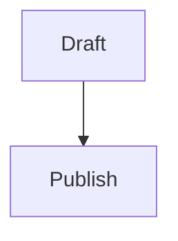

# benpearson.dev

Hugo source for `benpearson.dev`, with a repo-owned publisher script that exports selected Obsidian notes into the public site.

## Content Workflow

Draft in Obsidian under:

```text
/home/ben/vault/Human/Public Blog/
```

Use this frontmatter contract:

```yaml
---
title: "Readable Public Title"
should_publish: true
content_type: lab # post or lab
summary: "Short summary for listings."
tags:
  - ai
---
```

On first publish, the script derives `slug` from the filename and writes it back to the Obsidian note. Later publishes reuse the existing `slug`, so renaming the Obsidian file does not change the public URL.

After a successful publish, the script sets `should_publish: false`. To overwrite an existing public page, set `should_publish: true` again.

### Images And Other Post Media

Posts are published as Hugo page bundles:

```text
content/writing/my-post-slug/
├── index.md
├── hero.webp
└── screenshot.webp
```

Keep publish-ready media outside the Obsidian vault under:

```text
/home/ben/public-blog-media/<slug>/
```

When a note is published, the publisher copies everything from `/home/ben/public-blog-media/<slug>/` into `content/writing/<slug>/`. Those copied files should be committed with the post so Cloudflare Pages has them during the Hugo build.

Reference media with relative Markdown paths:

```markdown

```

Prefer optimized `.webp` files for screenshots and photos. Keep original, uncompressed assets outside this repo.

### Mermaid Diagrams

Use standard fenced Mermaid blocks in Obsidian:

````markdown

````

Hugo renders these as Mermaid diagrams and loads Mermaid only on pages that include a Mermaid block.

## Publish From Minibot

Run from this repo:

```bash
npm run publish:vault
```

A cron job on `minibot` can run that command, then commit and push changes if the working tree changed. Keep credentials in the local machine account; do not store secrets in this repo.

## Development

Run publisher tests:

```bash
npm test
```

Build the Hugo site:

```bash
hugo --minify
```

Hugo is not vendored. Install it locally or let Cloudflare Pages provide it during builds.

## Cloudflare Pages

Suggested build settings:

- Build command: `hugo --minify`
- Build output directory: `public`
- Environment variable: `HUGO_VERSION` set to a current extended Hugo release
