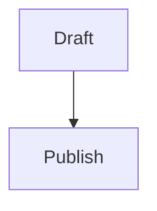

# benpearson.dev

Hugo source for `benpearson.dev`.

## Content Workflow

Write posts directly as Hugo page bundles:

```text
content/writing/my-post-slug/
|-- index.md
|-- hero.webp
`-- screenshot.webp
```

Use this frontmatter contract:

```yaml
---
title: "Readable Public Title"
slug: my-post-slug
content_type: post # post, lab, or thought
summary: "Short summary for listings."
date: 2026-05-25
draft: true
tags:
  - example
---
```

Use `post` for polished articles, `lab` for experiments and implementation notes, and `thought` for standalone ideas or observations that do not need a project or code behind them. Keep generated or experimental posts as `draft: true`. Preview drafts locally with `hugo server -D --port 1313`. To publish a post, remove `draft: true` or set it to `false`, then commit and push.

### Images And Other Post Media

Store post media in the same page bundle as `index.md`. Commit those files with the post so Cloudflare Pages has them during the Hugo build.

Reference media with relative Markdown paths:

```markdown

```

Prefer optimized `.webp` files for screenshots and photos. Keep original, uncompressed assets outside this repo.

### Mermaid Diagrams

Use standard fenced Mermaid blocks:

````markdown

````

Hugo renders these as Mermaid diagrams and loads Mermaid only on pages that include a Mermaid block.

## Development

Run tests:

```bash
npm test
```

Build the Hugo site:

```bash
hugo --minify
```

Hugo is not vendored. Install it locally or let Cloudflare Pages provide it during builds.

## Cloudflare Pages

### Monster Hotel

The standalone game at `/monster-hotel/` is a built copy of
[monster-hotel-bubble-trouble](https://github.com/hoombar/monster-hotel-bubble-trouble),
stored in `static/monster-hotel/`. It is intentionally not listed in site navigation.
Hugo copies it into the published site without applying the blog layout.

To release an update, run `npm ci` and then `npm run publish:site` in the game
checkout, with both repositories alongside one another. The command builds for
`/monster-hotel/` and replaces only this static game folder. Review and commit
the generated changes here, then push to deploy through the usual site pipeline.
Edit game source in its own repository, not in the generated files here.

### Build Settings

Suggested build settings:

- Build command: `hugo --minify`
- Build output directory: `public`
- Environment variable: `HUGO_VERSION=0.147.5`
- Production branch: `main`
