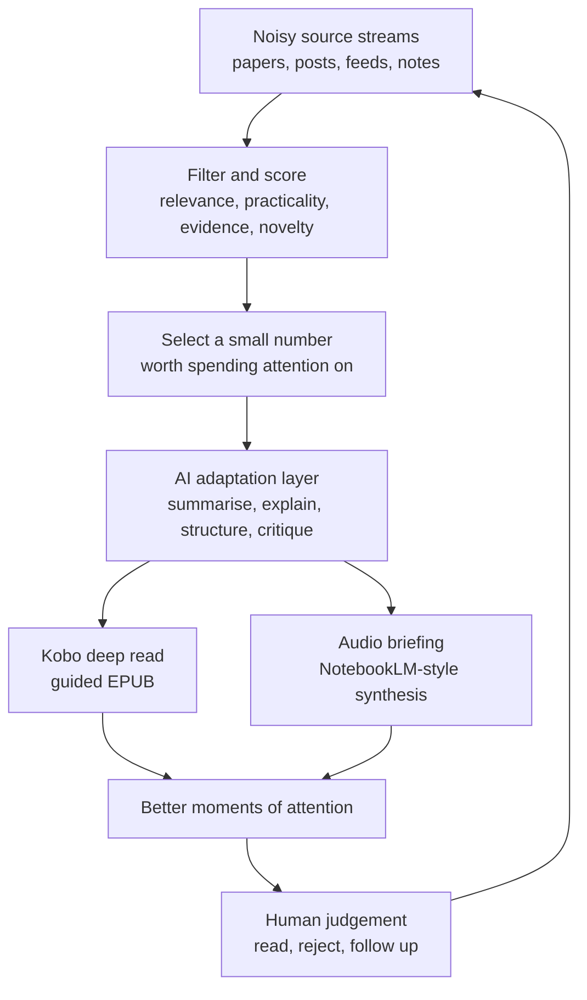
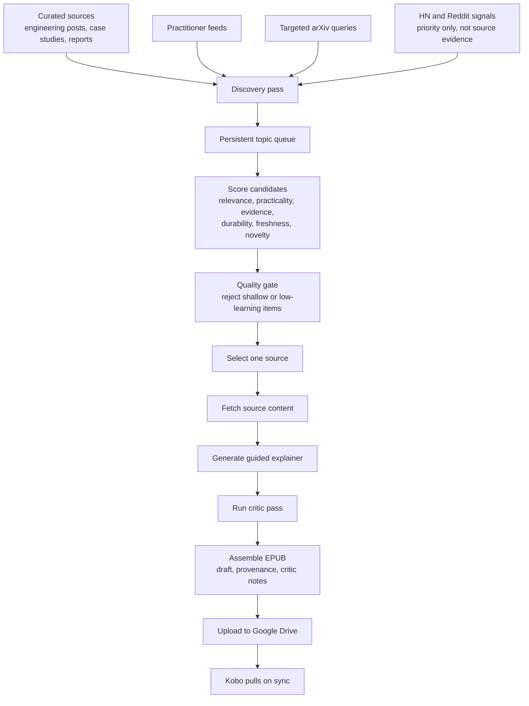

## Keeping Up Is An Input Design Problem

Keeping up with AI is not just a reading problem. It is an input design problem.

There is too much material, but that is not quite the hard part. I can live with there being more papers, model releases, engineering posts, and interesting experiments than I will ever read. The harder part is that most of it arrives in forms that do not fit the way I actually pay attention.

An interesting paper appears while I am meant to be working. A good engineering write-up gets buried in a feed. A useful thread points to something deeper, but the deeper thing is a PDF, a repo, or a long post that needs a clear half-hour. By the time I have found it, saved it, and vaguely promised myself I will come back to it, the moment has usually passed.

> The hard part is not finding more AI material. It is turning the right material into attention I will actually spend.

That has pushed me towards a slightly different use of AI. I am less interested in asking a model to tell me what happened, and more interested in using AI to reshape useful material into formats that fit my routines.

## Reading Adapters

I have started thinking of these workflows as reading adapters.

The adapter does not remove judgement. It does not decide what I should care about forever, and it does not turn every source into truth. It sits between a noisy input stream and a real consumption habit. Its job is to change the format, length, structure, and delivery path so the material has a better chance of being used.

For me, the two useful output formats are fairly mundane:

- A guided EPUB that I can read on a Kobo.
- A listenable briefing that I can use while walking, driving, or doing something low-attention.

The overall shape looks like this:

That loop is the important part. The workflow should make it easier to meet good material at the right time, but it should still leave me with the work of reading, rejecting, following up, and tuning the system.

## Workflow 1: Turning Sources Into Kobo Deep Reads

The more developed version of this is my Kobo pipeline. It is designed around a simple constraint: if I want to read something properly, it should end up on the device I already use for reading.

A browser tab is a weak commitment. A saved PDF is only slightly better. An EPUB on a Kobo is a different object. It has fewer distractions around it, it sits in the same place as books, and it is easier to treat as reading rather than browsing.

> An EPUB on a Kobo is a different object from a tab in a browser.

The pipeline currently does roughly this:

There are a few design choices in there that matter more than the mechanics.

First, it prefers a single-source deep read. Earlier versions of this kind of workflow can easily drift into generic multi-source summaries. Those are sometimes useful, but they are also where the model can blur the edges between sources. A single-source read keeps the object clearer: here is one paper, one engineering post, or one report, adapted into a form I can read.

Second, the queue is persistent. The system does not need to find the perfect thing every time it runs. It can discover candidates, score them, leave them pending, and pick the best available item when it is time to generate something. That makes it easier to tune the workflow over time, because rejected, processed, and pending items all tell me something about the scoring assumptions.

Third, social signals are deliberately not evidence. Hacker News or Reddit can help identify that something might be worth looking at, but I do not want the generated read to be based on comments or popularity. Those signals can raise the priority of a source; they should not become the source.

## Provenance And Critic Notes

The part I care about most is the provenance and critic layer.

If AI produces a neat explainer, it is very easy for the neatness to hide uncertainty. That is a bad trade. I would rather have a slightly messier output that tells me what it used, why it was selected, and where the weak spots might be.

So the generated EPUB includes source provenance and critic notes. The provenance gives me the source URL, source type, selection score, and quality-gate context. The critic pass is an adversarial read of the generated explainer. It does not block publication in my current setup, but it gives me a second view of where the generated version might be overconfident, incomplete, or misleading.

> The generated article should not pretend to be the source. It should be a guided route back into the source.

That distinction matters. I am not trying to build a machine that reads for me. I am trying to build a machine that prepares better reading material for me.

## Workflow 2: Turning Notes Into Audio

The NotebookLM workflow is simpler, but it fits the same pattern.

Sometimes the source material is not a public article or paper. It is a folder of notes, a set of project documents, or a collection of things I have already captured but not revisited. In that case, the useful output is not always another document. Sometimes it is a listenable synthesis that helps me notice the shape of the material before I go back into the details.

The workflow is basically:

- Gather the relevant notes or documents.
- Combine them into a source bundle with enough context to stand alone.
- Ask for a structured summary or podcast-style outline that preserves the main themes and open questions.
- Use NotebookLM to turn that into audio.
- Listen for themes, gaps, and follow-up ideas.

This is not where I would do careful technical review. Audio is too linear for that. But it is good for keeping a subject warm in my head, noticing repeated themes, or turning a pile of notes into something I can revisit while doing something else.

The same design rule applies: the output should create a better moment of attention, not just another artefact to manage.

## The Reusable Agent Pattern

The pattern behind both workflows is reusable:

1. Start with an input stream that is too noisy, scattered, or awkward to use directly.
2. Add a selection layer so the system is not trying to process everything.
3. Use AI to adapt the selected material into a format that fits a real habit.
4. Preserve enough provenance that the output can be checked against the source.
5. Add a critic or review step where the cost of being wrong is high enough to matter.
6. Deliver the output somewhere it will actually be consumed.

That last step is easy to under-value. A lot of automation projects stop at generating a file. For me, the delivery path is part of the product. If the file lands somewhere I ignore, the system has not worked.

This is also why I have put some of the workflow into my [open-source Claude skills repo](https://github.com/hoombar/claude-skills). The useful bit is not just the script. It is the set of assumptions around source quality, scoring, generation, critique, and delivery. Writing those assumptions down makes the workflow easier to reuse and easier to argue with.

## The Trap

The obvious trap is that this can become a machine for producing more things I do not read.

That is why I think the useful measure is not throughput. I do not care how many summaries, briefings, or EPUBs the system can generate in theory. I care whether it creates a small number of better opportunities to understand something.

> The useful measure is not how much content the system generates. It is whether it creates better moments of attention.

That changes how I think about the agent workflow. The goal is not autonomy for its own sake. It is a better interface between a messy information environment and my limited attention.

I still read original sources. I still ignore most things. I still have to decide what is worth caring about. But when the stream is too noisy, AI can help me turn a few pieces of it into something I can read, listen to, and think with.

That feels like one of the more practical uses of AI for me at the moment: not replacing the reading, but making better inputs for it.
