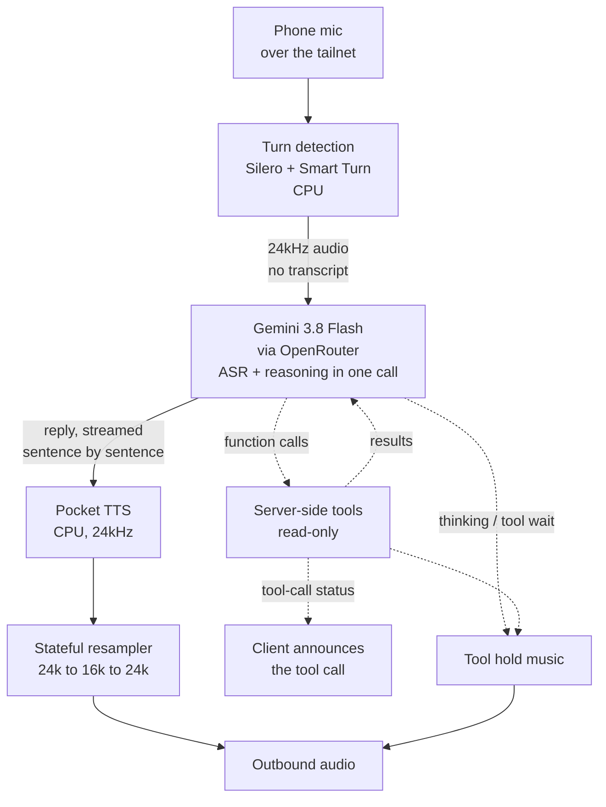

My voice agent moved house this week. It started the week running on ElevenLabs' servers; it ended it running on a mini PC in my home.

I had built the ElevenLabs version with my own MCP tools behind it, and written about [the memory and tools that made it useful](/writing/voice-agent-mcp-boundaries/). The rebuild keeps all of that, but the whole speech stack now runs in-house on top of [Hugging Face's speech-to-speech](https://github.com/huggingface/speech-to-speech). It listens at home, asks Gemini 3.8 Flash what to say, and speaks at home again. The only part that still leaves the building is the model call itself.

The new stack runs on [`minibot`](/writing/stop-carrying-the-agent-around/), the small mini PC on my home network that already runs most of my other experiments. It does the whole speech loop locally on a machine with no GPU, and it deletes the speech-to-text stage entirely: Gemini 3.8 Flash hears the microphone audio directly through OpenRouter and does the transcription and the thinking in one call. The tools moved server-side, and there is even hold music while a tool runs.

Getting there took 25 numbered versions and one genuinely annoying bug. The bug is the part I remember most, but the frame is bigger than the bug: this is the story of taking an agent I was renting and moving the whole stack in-house.

## Why I Moved It In-House

The ElevenLabs agent worked well. The speech sounded better than anything I could run myself, and the MCP server behind it already solved the "voice needs memory and tools" problem, so I did not want to lose any of that.

The thing that pushed me over was not the cost. It was a stutter.

When the ElevenLabs agent started a reply, the first five or ten seconds of audio would jitter and stutter before it settled. It was annoying in exactly the way a small persistent fault is annoying, and because the speech stack was not mine, there was nothing I could do about it except wait for it to sort itself out.

That was the real problem. I could not submit a fix to somebody else's pipeline; I could only hope. Moving the stack in-house, on top of an open project, meant that when something went wrong I could get into the code and actually solve it. I had no idea how hard this particular problem would be, but at least it would be mine to solve.

## Cutting Out Speech-To-Text

The conventional voice agent is a cascade: speech-to-text, then a language model, then text-to-speech. Three models, each adding a round trip, each with its own way of getting something subtly wrong. Transcription alone adds delay and a place for the model to mishear me before it starts thinking.

Current multimodal models can take audio directly. I send the microphone audio to Gemini 3.8 Flash, which is both multimodal and genuinely fast, and it does transcription and reasoning in one hosted call. The pipeline becomes:

`turn detection -> multimodal model -> text-to-speech`

Deleting that stage removed a round trip and a place for the system to mishear me. [Hugging Face's speech-to-speech](https://github.com/huggingface/speech-to-speech) is built as a swappable pipeline, so I could point the middle stage at an audio model instead of a text one and stop treating it as a TTS pipeline.

> The fastest component is the one you do not have to run.

There is a real tradeoff, and I want to be honest about it. With no local speech-to-text there is no live partial transcript of what I said, so the on-screen caption only shows the assistant's words. And the microphone audio still leaves the box, which is exactly the thing I said I wanted to reduce. I picked Google through [OpenRouter](https://openrouter.ai) because it meets the data-handling guardrail I use for everything else. I have not moved all of it home. I have moved most of it.

## The Hardware Is Not Supposed To Do This

The speech-to-speech project assumes you have a GPU. `minibot` is a GMKtec G3 Pro: an i3 with two cores and four threads, 16 GB of RAM, integrated graphics, and no usable accelerator at all. Everything runs on that CPU.

That constraint shaped almost every choice in the build. With a GPU, I would have reached for a bigger model and never learned what the small ones can do. Without one, every component has to earn its place, and the choices get more interesting.

The clearest example was replacing the text-to-speech engine. Kokoro sounded fine, but on this CPU it synthesised at roughly a third of real time, so a long sentence would sit silent for ten seconds before any of it played. [Pocket TTS](https://github.com/kyutai-labs/pocket-tts) from Kyutai streams instead, and cut memory from 3 GB to about 1.5 GB on the way through. (The direct-audio pipeline now sits nearer 1 GB.) It starts speaking after a fraction of a second even when the sentence is long, which is the difference between a tool I use and a demo I show people once.

## What The Pipeline Actually Looks Like



The backend speaks the OpenAI Realtime protocol over a WebSocket, which matters more than it sounds. The client is just a browser tab, so I can change the client without touching the pipeline. Turn detection is [Silero VAD](https://github.com/snakers4/silero-vad) plus [Smart Turn](https://github.com/pipecat-ai/smart-turn) deciding when I have actually finished speaking. The flags that define the backend are short enough to read:

```text
serve --device cpu --stt none --llm_backend chat-completions
  --model_name google/gemini-3.8-flash
  --responses_api_base_url https://openrouter.ai/api/v1
  --responses_api_stream --responses_api_reasoning_effort low
  --speculative_reopen_ms 500 --stream_batch_sentences 1
  --tts pocket --pocket_tts_voice alba --pocket_tts_device cpu
```

I expose it through [Tailscale](https://tailscale.com) `serve`, so it is reachable from my phone on the tailnet and nowhere else. Browsers need HTTPS for microphone access, and a `*.ts.net` certificate already gives me that. One small thing that cost me an evening: the OpenRouter base URL is `https://openrouter.ai/api/v1`, and `api.openrouter.ai` does not resolve at all. The whole thing is two user services on `minibot`: one for the backend, one for the UI.

## The Latency Budget

The first working version took ten seconds before I heard anything. The current one is three to four seconds on a warm turn, and the budget is small enough to reason about:

| Stage | Cost | Notes |
| --- | --- | --- |
| Turn detection and reopen grace | ~0.5 s | waits for you to actually finish |
| Upload plus model first token | ~2.2 s | the hosted call is the floor here |
| First TTS chunk | ~0.3 s | Pocket streams as it synthesises |
| **Total to first audio** | **~3–4 s** | down from 10 s+ |

The single biggest cut was telling the TTS to start on the first sentence instead of waiting to batch three of them, which took first audio from 5.8 seconds to 3.1. The rest is the model, and I have accepted that cost on purpose. `gemini-3.1-flash-lite` replied in 1.31 seconds, but `gemini-3.8-flash` takes about 2.2 and is noticeably better at the actual work. The difference between a fast wrong answer and a slightly slower good one is obvious the moment you use it out loud.

## Twenty-Five Versions Of The Wrong Thing

The problem I remember most kept changing its name. It started as static, the way a blown speaker sounds, then became a rattle, then a stutter, then clipping on the end of each word, and finally something like somebody tapping a pen on a table while the assistant spoke. It arrived with the first working playback and was subtle, intermittent, and level-independent: turning the volume down did not remove it, and it was audible over Bluetooth as well as the phone speaker, which told me the phone's DAC was not to blame. Over the next day I shipped 25 versions of the client trying to kill it. The cache key that tracks the client work ended up at `audio-24k-v25`.

Most of those versions are worth keeping, even though none of them was the answer:

| Version | What I changed | What it actually did |
| --- | --- | --- |
| v4–v8 | output gain, fades, limiter | made it loud enough to hear; not the tap |
| v9 | underrun telemetry, adaptive resume | found playback that stalled and restarted |
| v12 | echo cancellation on barge-in | stopped the assistant cutting itself off |
| v14 | soft-clip instead of a hard clamp | removed one real distortion |
| v15–v16 | a `?gain=` override and a Bluetooth test | proved the digital stream was clean |
| v17–v18 | playback clearing and echo ducking | fixed barge-in, broke it, fixed it again |
| v19 | allocation-free capture worklet | a big reduction, and the wrong explanation |
| v20 | a click detector in the debug HUD | gave me a number to argue with |
| v21 | orphaned audio filtering, longer fades | killed ghost audio and seam clicks |
| v24 | a calibration experiment | the last guess before I changed approach |
| v25 | barge-in repairs | the final client version |

Some of those fixes were real bugs. The hard clamp after a 2× gain stage was a defect. The orphaned audio deltas were real. The unconditional playback clear on any detected speech was real, and it was breaking barge-in badly. But none of them was the tap, and the client was never going to be the answer.

> Twenty-five versions of client fixes, and the client was innocent.

## Build An Instrument Instead Of Listening Harder

I did not find the bug by listening harder. I found it by building instruments I could trust more than my own ears.

I added a debug HUD behind `?debug=1` that showed playback queue depth, underruns, and a running click count. I added an output recorder behind `?record=1` that captured exactly the samples leaving the pipeline rather than what the speaker did with them. I kept a raw WebSocket capture script so I could replay a session without talking to the phone at all. Each one ruled something out, which is slower than fixing things and much faster than guessing.

The other thing that unblocked me was changing models. I had been iterating with [GLM-5.3-Flash](https://z.ai), and it had reached the point where it was certain there was nothing left to try, which is a bad place for a debugging session to end up. I switched to GPT 6 Astra and asked for a fresh list of hypotheses, then switched back to GLM-5.3-Flash in the same context window and had it work through them one at a time. The second one was the resampling path.

That path is where the fixed-sample A/B came in. Instead of changing the code again, I pushed the same sentence through three routes in a single go:

- **A** — the original audio, untouched.
- **B** — the exact resampling chain the production path used.
- **C** — a single continuous resample of the whole stream.

A and C were mathematically identical. B had the tap. I listened on the same phone I had been listening with all day and gave the least technical verdict of the entire investigation: "A is fine and B stutters."

<!-- MEDIA: optional HUD screenshot. Add hud.webp and replace this comment.

-->

## Two Lines Of Resampling

Pocket TTS synthesises at 24 kHz. The pipeline internally runs at 16 kHz. The browser asks for 24 kHz. So every piece of audio was resampled twice, and both conversions called scipy's `resample_poly` fresh on each chunk instead of treating the audio as one continuous stream.

Two things go wrong when you resample a stream chunk by chunk. A polyphase filter carries a short history of the samples before it, so restarting it at every boundary drops that context and injects a small transient. And the filter's phase depends on where the chunk starts in the absolute sample stream, so chunk boundaries that do not land on clean multiples shift the output grid by a fraction of a sample every time.

Each boundary error measured around 0.13 peak, well below the threshold of the click detector I had built. But a tiny periodic error repeated every couple of hundred milliseconds is not a click. It is a texture, and the ear reads it as tapping.

The fix was a stateful streaming resampler: lock the phase, keep the left history, and hold back a window of right context so each block comes out bit-exact against resampling the whole stream in one go. It replaced the same three conversion points and ended a bug that had survived 24 other attempted fixes.

Along the way I was confidently wrong about at least five things. The phone's speaker path. Garbage collection in the capture worklet, which was a real inefficiency but not the tap. Echo, which was a separate bug causing separate cancellations. A "WAV pacing difference" that was really me writing a 24 kHz header onto 16 kHz audio, inventing a 1.5× speedup that did not exist. And Pocket synthesising at 3.4× real time, which came from counting PCM16 bytes as samples at two bytes each. I have kept all of those retractions in my notes, because the wrong answers are the part I would otherwise repeat.

## Hold Music And Tool Calls

A tool call is not just a request and a result. It is three separate silences in a row: the model's time to first token after I stop speaking, the tool executing server-side, and the model's second round trip to turn the result into an answer. On a tool-heavy question, that is several seconds of dead air in the middle of a conversation.

So I added hold music. Not as a gimmick, but because a silent voice agent feels broken even when it is working. The controller covers all three windows and streams the loop through the normal outbound audio path, so the browser and the phone play it with no client changes at all. It is quiet, it never plays over speech, and it stops the instant the real answer starts. There is a master switch, a volume setting that defaults to 0.4, and a 45-second cap so a stuck turn cannot loop forever. If the asset is missing or malformed, it disables itself rather than failing the turn.

The tools themselves run on the server rather than in the browser. When the model calls one, the backend executes it, injects the result into the conversation, and claims the follow-up so the answer streams back as if nothing had happened. The client is still told that a tool is running — the UI announces it, and the hold music covers the wait — but the result is handled server-side. The tool surface is deliberately small and read-only, the same boundary I set up for the ElevenLabs version, because a spoken request still deserves a permission model. There is more detail in [the earlier post](/writing/voice-agent-mcp-boundaries/) if you want the shape of it.

<!-- MEDIA: optional voice-turn demo. When the clip is ready, drop voice-demo.webm (and a voice-demo.mp4 fallback) into this bundle folder and replace this comment with the block below.
<video controls preload="metadata" playsinline>
  <source src="voice-demo.webm" type="video/webm">
  <source src="voice-demo.mp4" type="video/mp4">
</video>
_A real turn, including the hold music while a tool runs._
-->

## What Still Leaves The House

Bringing the loop in-house does not mean keeping everything at home, and that deserves some honesty.

The model call still leaves the house, and the microphone audio goes with it. There is no local partial transcript. The phone's browser kills audio when the screen turns off, so a long conversation needs the screen awake until I wrap the page in a tiny app that holds a wake lock. The WebRTC transport is wired up and untested in real use. And because this is a fork with local patches, every upstream release will conflict somewhere, most likely in exactly the resampler I just fixed.

None of those are dealbreakers. All of them are the price of bringing the loop in-house, and I would rather name them than pretend the trade is free.

## What In-House Actually Means

The practical change is that the speech loop now runs on a box in my house instead of on ElevenLabs' servers. I replaced a subscription with a pipeline I can read, on a machine I can SSH into, serving a client I can rewrite. The only thing I still send out is the model call, and if I wanted to, I could swap that for a local model on better hardware without touching the rest.

The next decision is what to do with the fork. The resampler fix is the kind of thing that belongs upstream, where it would help anyone running this pipeline across mixed sample rates, but carrying it as a local patch means every upstream release conflicts somewhere. I have not worked out which is less work.

For now the whole loop runs in-house, on a box that was never meant to host it, and the only part that still leaves is the question itself. I am still deciding whether that trade is worth the maintenance.
