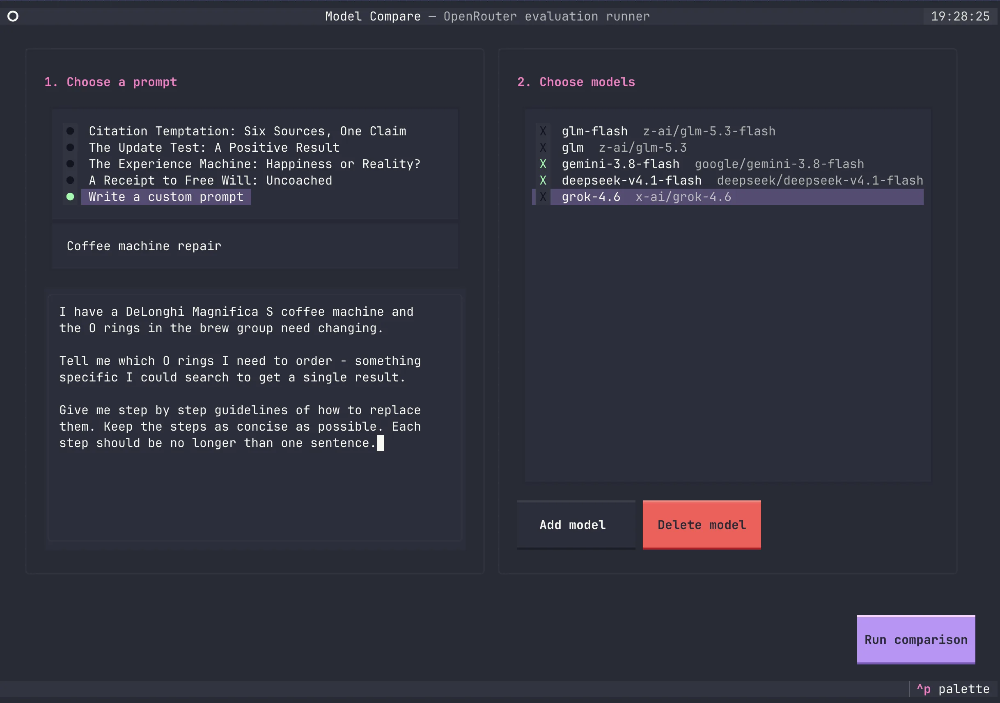
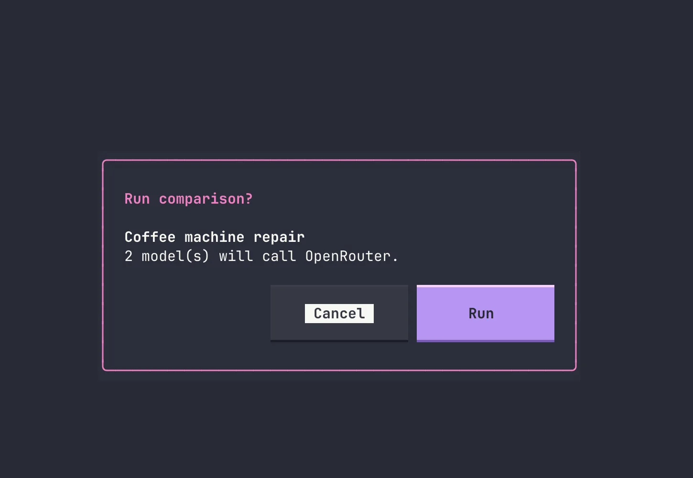
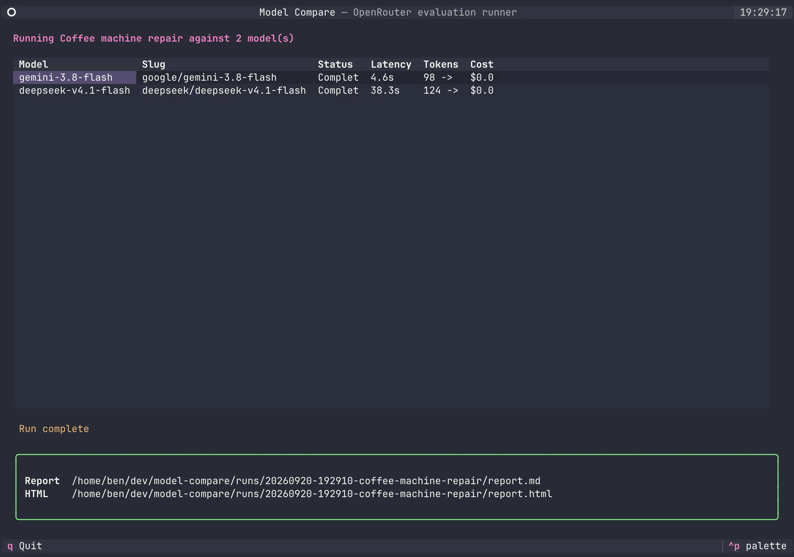
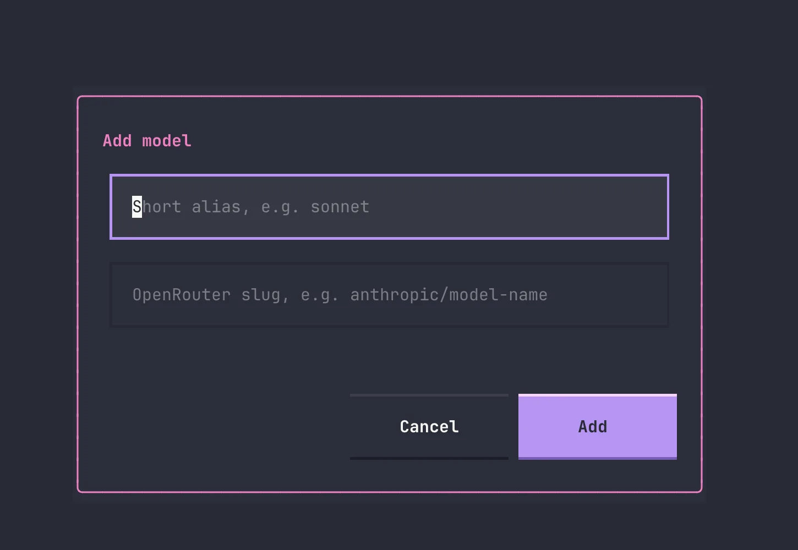
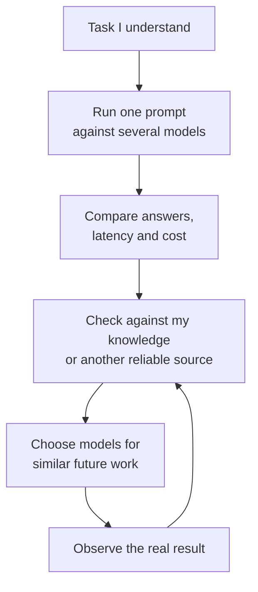

The most useful result from my latest model comparison cost $0.013666, and neither model got the whole answer right.

I needed to replace two O-rings in the brew group of my DeLonghi Magnifica S coffee machine. Gemini returned the part number I had already identified in 4.6 seconds, but its replacement procedure skipped the disassembly needed to reach the seals. DeepSeek took 38.3 seconds and described the disassembly much more usefully, but gave me part numbers that did not match the ones I needed.

That tells me more than another general model leaderboard. One model was better at identifying the part. The other was better at explaining how to fit it. Neither was simply "the best model".

## A General Leaderboard Is Not Enough

For a while, my choice of model was mostly decided by the subscription I had. If I was paying for Claude or Codex, that became the model I used for nearly everything, even when the task had little to do with coding.

That constraint is disappearing. There are now plenty of cheap API models, including hosted open-weight models, that are good enough to be genuinely useful. I can use one for research, another to help me think through nutritional options, and another to compare products or plan a holiday. Models have different training data, different post-training, and different tendencies when they do not know something.

Those differences matter more once switching models becomes cheap.

> I do not really need to know which model is best. I need to know which model is useful for the job in front of me.

If I already know something about a subject, I can use that knowledge to test a model. Before asking one to plan a holiday somewhere unfamiliar, for example, I could ask it to plan trips in two places I know well. If it misses the activities I would recommend, invents awkward journeys or produces a plan that looks good but would be miserable to follow, I have learned something useful before relying on it somewhere new.

The problem is doing that comparison without opening several chat windows, copying prompts around and losing track of which answer came from where. That is why I built [model-compare](https://github.com/hoombar/model-compare).

## From Question To Report

There is not much ceremony to it. I run `model-compare`, write or paste a question, and tick the models I want to try.



The tool shows the prompt title and number of models once more before making any billable calls. I hit **Run**, and the requests go out in parallel.



As each model finishes, its latency, token use and cost appear in the table. The final screen points me to the Markdown and HTML reports, where the complete answers sit beside each other.



That is the whole interaction: prompt, models, run, report. It takes less effort than repeating a question across several chat interfaces, which means I might actually compare models at the moment the answer is useful.

## One Prompt, Several Models

Model Compare sends the same prompt to several models through [OpenRouter](https://openrouter.ai), then writes a Markdown and HTML report containing the prompt, complete responses, model slugs, latency, token usage and cost.

The models can be proprietary or open-weight. My current configuration includes options from Google, DeepSeek, xAI and Z-AI:

```toml
glm-flash = "z-ai/glm-5.3-flash"
gemini-3.8-flash = "google/gemini-3.8-flash"
deepseek-v4.1-flash = "deepseek/deepseek-v4.1-flash"
grok-4.6 = "x-ai/grok-4.6"
```

I choose the models per run because the shortlist changes more often than the tasks. Saved tasks are Markdown files with a title, system prompt and user prompt, while one-off questions can be entered directly in the interface.

Aliases can be added without leaving the TUI, so trying a newly released OpenRouter model is just a name and its provider/model slug.



Model Compare does not automatically score the answers or ask another model to declare a winner. That would replace the judgement I care about with another model response. It puts the answers beside each other and keeps enough information around for me to review them myself. It does not route or combine answers either; it gives me evidence I might later use to build those rules.

## The CLI Worked Until I Came Back To It

The first version was a basic command-line tool. It loaded a prompt from Markdown, ran it against several models in parallel, and generated the reports. Models lived in a small TOML file and a typical run looked like this:

```bash
model-compare prompts/diagnostic-update.md \
  --models gemini-3.8-flash,deepseek-v4.1-flash
```

I also built up a collection of 17 prompt files. There was a trolley problem, an experience-machine question, a chain from a supermarket receipt to free will, tests for belief foundations and political reasoning, and coached variants to see whether a model improved when the instruction became more explicit.

Those were useful while I was exploring what the tool could measure, but they were not how I wanted to use it over time. It is unlikely that I will keep asking every new model the same trolley problem. My actual questions arrive when a coffee machine breaks, I am considering a holiday, or I need to research something I did not know I would care about the day before. In those cases the quickest route should be typing a custom prompt, not creating another permanent test file.

The current version keeps four saved prompts as reusable diagnostics, but makes **Write a custom prompt** a first-class option. Custom prompts appear in the report without being added to the library.

The CLI worked while I was building it and remembered all the conventions. When I came back later with the coffee-machine question, it felt clunky and slow. I needed to make a prompt file, check the aliases, assemble the command and then find the resulting report. None of those steps was difficult, but together they were enough friction that I could see myself opening a normal chat window instead.

Before running the comparison, I used [OpenCode](https://opencode.ai/) to build a [Textual](https://textual.textualize.io/) interface around the existing runner. The important boundaries were already in place: prompt loading, model configuration, parallel requests and report generation did not need to be rebuilt. The TUI just made them easier to use.

Now `model-compare` with no arguments opens the interface. I can choose a saved prompt or write a one-off question, select models, add or remove aliases, confirm the billable run, and watch each request complete. The CLI is still there for repeatable tests and scripts, but the TUI is what makes the tool useful when a question occurs to me.

## The Coffee Machine Test

The prompt was deliberately practical:

```text
I have a DeLonghi Magnifica S coffee machine and the O rings
in the brew group need changing.

Tell me which O rings I need to order - something specific I
could search to get a single result.

Give me step by step guidelines of how to replace them. Keep
the steps as concise as possible. Each step should be no longer
than one sentence.
```

For this first pass I selected two models from my current shortlist: the OpenRouter slugs `google/gemini-3.8-flash` and `deepseek/deepseek-v4.1-flash`. You can [open the complete HTML report](coffee-machine-report.html) rather than taking my summary of it.

| Model | Time | Cost | Part lookup | Procedure |
|---|---:|---:|---|---|
| Gemini 3.8 Flash | 4.6s | $0.004112 | Matched the part I needed | Missed required disassembly |
| DeepSeek V4.1 Flash | 38.3s | $0.009554 | Did not match the parts I needed | Included the useful disassembly |
| **Total** |  | **$0.013666** |  |  |

Gemini told me to order two `DeLonghi 5332149100` O-rings, which matched the specific part I had already identified for my machine. It then said to remove the brew group and prise the old O-rings out of the upper and lower grooves.

That procedure was no use. The seals are on the piston inside the brew group. I could not even see them without removing the screws, opening the assembly and popping the piston out.

DeepSeek included those missing steps. It described removing the Torx screws and shower screen, pushing down the piston, tapping out the retaining pin, and removing the piston, spring and guide assembly before changing the seals. That was much closer to the procedure I needed.

Unfortunately, it told me to order parts `5313214351` and `5313214352`, and neither matched the parts I needed for this repair.

The slower answer used 8,350 completion tokens rather than 1,077 and cost more than twice as much. It still failed the first and easiest-to-check requirement. The faster answer found the right part but described a repair that could not be completed as written. I would not have wanted to follow either response on its own.

## The Report Is Not The Verdict

The report keeps the evidence together, but the review is still human work. For the coffee machine, my existing knowledge was enough to recognise that Gemini's instructions could not reach the seals and that DeepSeek's part numbers were wrong.

For less familiar tasks I would need another way to check: a parts catalogue, service manual, trusted source, physical inspection, or someone who knows more than I do. Agreement between models is not verification because two models can repeat the same common mistake.

I also would not treat one run as a permanent characteristic of a model. These were single responses from two mutable OpenRouter model slugs on 20 September 2026, not a controlled benchmark with fixed model revisions, providers, temperatures or repeated trials. If a result is useful enough to change what I do next, I need to repeat it on similar tasks.



## What I Might Build Next

The next thing I want to try is a general repair research skill. It could be invoked when I say something is broken or use words such as "fix" or "repair". Instead of sending the whole request to one default model, it could separate the work:

- Identify the appliance and exact variant.
- Find specific parts or part numbers.
- Work out the disassembly and replacement procedure.
- Flag electrical, pressure, heat or other safety concerns.
- Present the combined result with clear links back to its sources and model responses.

The coffee-machine test suggests that parts lookup and procedural guidance may deserve different routes. These particular responses make Gemini useful for the first and DeepSeek useful for the second. That is not enough evidence to hard-code those choices, but it gives me a hypothesis I can test.

A washing-machine belt would be a good next case. The skill could route the belt lookup to models that have performed well at finding exact parts, then route the replacement procedure to models that have been better at mechanical disassembly. I could check the result against parts catalogues, service information and the actual machine before touching anything.

The aim is not to splice two plausible answers together and trust the result. Combining Gemini's part number with DeepSeek's procedure looks useful here, but the combination still needs checking. The skill should make that checking easier rather than pretend the joined answer came from one reliable source.

## Some Tasks Need A Different Boundary

I also use models to help me think about nutrition and medical records, where the consequences and privacy concerns are different. Choosing a model that gives a better answer does not solve either problem.

Raw medical records and detailed nutrition data are sensitive personal information. With the current tool, the prompt goes to OpenRouter and then to whichever upstream provider serves the request, so I need to understand both sets of data-handling terms and the routing settings. An open-weight model is not automatically private when somebody else hosts it. For real records I need to remove identifying information or use a separate local workflow; Model Compare does not currently run local models.

The output is also preparation for professional judgement, not a diagnosis or a replacement for a doctor, dietitian or other qualified professional. A model might produce the clearest summary and still be the wrong one to use because I am not comfortable sending it the data.

For now, I have one useful repair result and a tool that is finally easy enough to run when a question occurs to me. I do not yet know how many verified repairs it would take before I trusted a routing rule, but one is clearly not enough. The next broken appliance should make that judgement a little less hypothetical.
