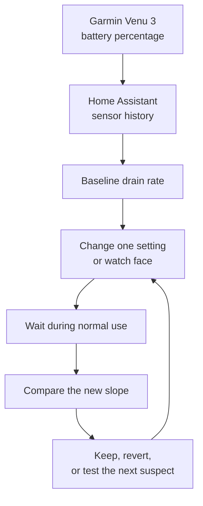

## A Watch Battery Problem Became A Data Problem

My Garmin Venu 3 was not lasting as long as it should have done.

Garmin's quoted figure for the Venu 3 is about 14 days in smartwatch mode, or around 8 days with the always-on display. Mine was landing somewhere more like 5.5 to 8.5 days depending on the week. That is not catastrophic, but it is also exactly the kind of thing that becomes annoying because it is slightly too vague to reason about from memory.

If I just looked at the battery percentage a few times a day, I could tell it was going down faster than I wanted, but I could not tell why. Was it a watch face? Was it Wi-Fi? Was it Spotify? Was it SpO2 overnight? Was I just noticing it more because I was paying attention?

The useful bit was that I already had the watch battery level flowing into Home Assistant.

> The moment a battery percentage becomes a time series, it stops being a feeling and becomes something you can debug.

That turned a slightly irritating consumer-device problem into a small observability exercise. I could change one thing, leave it alone, and then look at the slope rather than trusting my impression of whether the watch felt better.

## The Setup

The battery level came into Home Assistant through the Garmin/Home Assistant integration path, exposed as a normal sensor:

```text
sensor.garmin_device_battery_level
```

Home Assistant was already keeping history in its recorder database, so I did not need to build anything special. I could look at the state history in the UI or query the Home Assistant API and calculate the drain rate between two timestamps.

The calculation was deliberately simple:

```text
drain rate = battery percentage drop / hours elapsed
```

Garmin's 14-day smartwatch figure works out at roughly `0.298%/hr`. My real-world baseline was much worse:

| Period | Battery Drop | Duration | Drain Rate | Projected Life |
|---|---:|---:|---:|---:|
| Worst baseline | 52% to 4% | 64.8h | 0.741%/hr | 5.6 days |
| Better baseline | 81% to 71% | 20.8h | 0.482%/hr | 8.6 days |
| Main baseline | 100% to 49% | 88.3h | 0.578%/hr | 7.2 days |

Those numbers were useful because they showed two things at once. First, the drain really was worse than expected. Second, it was mostly smooth rather than spiky, which made a persistent background cost more likely than a single bad activity recording.

## The Remote Bit

The slightly fun part is that I was able to keep doing this while I was away, including while staying in a yurt on holiday.

I did not need physical access to the Home Assistant box, and I did not need to sit at my desk with a spreadsheet. The watch was reporting its battery, Home Assistant was storing the history, and I could check the current state and recent trend remotely.

That changed how practical the experiment felt. Instead of thinking "I'll check this properly when I get home", I could make a change on the watch, let normal life happen, and then check whether the battery slope had moved.



It is a small loop, but it is a good one. The important part is not the exact API call or the graph. It is having enough history to make each change comparable.

## The Suspects

The first pass was mostly about turning vague suspicion into a list of things that could be tested.

The obvious candidates were:

- Spotify installed on the watch, even though I was not actively using it.
- Wi-Fi being enabled, which can matter if a Connect IQ app keeps something awake.
- Watch faces with animated seconds or frequently updated complications.
- Gesture wake during the day.
- Overnight SpO2 and sleep tracking.
- Data-heavy complications such as weather, UV, Body Battery, stress, and respiration.

Some of those are not bugs. They are just features with a cost. The distinction matters because the right answer is not always "turn everything off". I still wanted the watch to be useful. I just wanted to know which bits were expensive enough to care about.

## What Changed The Slope

The first big improvement came from uninstalling Spotify and turning off Wi-Fi.

Before that change, one short recent window was draining at about `1.09%/hr`. After uninstalling Spotify and turning Wi-Fi off, the drain dropped to about `0.64%/hr`. That is still not brilliant, but it was roughly a 40% reduction from that high-drain window, which is too large to ignore.

There is a known pattern with some Garmin devices where music apps or sync behaviour can keep background processes alive, sometimes involving Wi-Fi. I cannot prove every internal detail from the outside, but the before-and-after was strong enough for my purposes: Spotify and Wi-Fi were not free.

The next useful finding was gesture wake. With gesture wake turned off during a daytime test, the watch dropped to about `0.38%/hr`, projecting roughly 10 days of battery life. That was a big improvement over the earlier baseline.

Then the watch face testing got interesting.

Orbit II, with data polling and animation, measured around `0.73%/hr` in one short test. Segment 34 MK2, a data-rich face with no seconds, settled closer to `0.44%/hr` over a longer window. Later, a full retained Home Assistant history window showed an observed discharge from `87%` to `3%` over just over seven and a half days, equivalent to about `0.466%/hr` and roughly `8.7 days` from full to 3%.

That was not the advertised 14-day figure, but it was much more understandable. The watch was no longer behaving mysteriously; it was behaving like a device with a set of measurable tradeoffs.

> The goal was not to get the watch into an artificial lab state. It was to find a configuration that made sense in normal use.

## The Findings

By the end of the first round, the main causes looked like this:

| Change | Observed Effect |
|---|---|
| Spotify removed and Wi-Fi off | Removed a large background drain, roughly 40% improvement from the worst recent window |
| Gesture wake off | Daytime drain dropped towards `0.38%/hr` |
| No animated seconds | Watch faces without seconds performed much better |
| Overnight SpO2 | Still a meaningful overnight cost, but expected and useful enough to keep |
| Data-heavy watch faces | Not all equal; some were materially worse than others |

The practical configuration I ended up trusting was fairly simple: Spotify removed, Wi-Fi off, short timeout, and a watch face that avoided animated seconds. That got the watch into a range where the battery life was good enough and the remaining cost was mostly explainable.

It also changed how I thought about watch faces. I had assumed the visible complexity of the face would roughly map to battery cost, but that was too simplistic. A face with several data fields can be fine if it avoids constant animation and does not poll aggressively. A simpler-looking face can still be expensive if it updates all the time.

## Why Home Assistant Was Useful

Home Assistant was not doing anything clever here. That is part of why I liked it.

It was just collecting a sensor value over time and making the history available. But that was enough to avoid the usual consumer-tech debugging pattern where you change three things at once, wait a day, forget exactly what changed, and then decide based on vibes.

The Home Assistant history gave me:

- A baseline before changing settings.
- A way to compare short and long windows.
- Enough detail to spot smooth drain versus sudden drops.
- Remote access while I was away.
- A record of when a change actually happened.

This is the bit I find reusable. Lots of small annoyances around the house are really time-series problems in disguise. A temperature that feels wrong, a sensor that keeps dropping off Wi-Fi, a watch battery that seems worse than it should be. Once the state is captured over time, you can stop arguing with your memory and start comparing windows.

## The Caveats

This was not a perfect experiment.

Battery percentage is coarse. The watch reports in whole percentages, so short windows can be misleading. A two-hour test might look better or worse just because of when the percentage ticked down. Longer windows are more trustworthy.

Normal life also gets in the way. A swim, a long GPS activity, a firmware update, a sync, or an unusually active day can all affect the slope. The point is not to pretend those variables do not exist. The point is to use enough history that they become visible rather than hidden in a general sense that the battery is bad.

I also would not treat these numbers as universal Garmin advice. They are specific to my Venu 3, my settings, my watch faces, and my usage. The reusable part is the method, not the exact answer.

## The Broader Pattern

The satisfying thing about this was not really the extra battery life. It was the shape of the debugging loop.

I had a device behaving slightly worse than expected. Home Assistant gave me a time series. That made it possible to test one change at a time, remotely, without turning it into a big project.

That is one of the quiet benefits of having a home automation system with history. It is not just there to turn lights on or run automations. Sometimes it becomes an observability layer for ordinary life.

> A smart home is more useful when it can help explain what happened, not just react to what is happening now.

In this case it helped me turn a vague battery complaint into a set of measured tradeoffs. I still have a watch with compromises, and I still have to choose which features are worth the battery cost, but at least the choice is less mysterious now.
