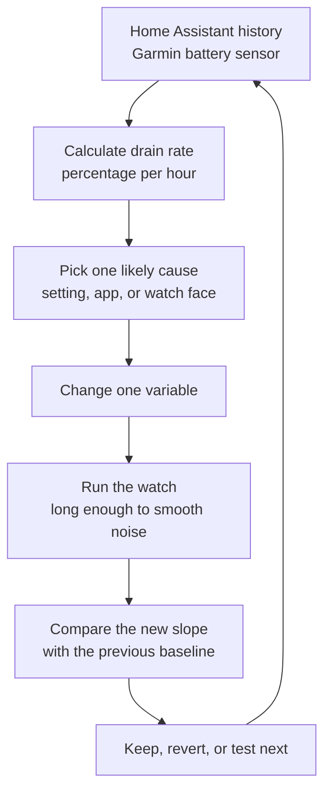

My Garmin Venu 3 said it should last close to two weeks. In normal use, it was landing nearer a week.

That gap is awkward because watch battery problems are easy to explain badly. It could be a health sensor. It could be the watch face. It could be a Connect IQ app behaving badly. It could be Wi-Fi, Bluetooth, notifications, GPS, a firmware bug, or just a setting I had forgotten about. The battery percentage on the watch is also a blunt instrument, so checking it now and then tends to produce opinions rather than evidence.

Home Assistant gave me a better way to look at it. I already had the Garmin battery level coming in as `sensor.garmin_device_battery_level`, with history stored by the recorder. That meant I could stop asking "how long does the watch feel like it lasts?" and start asking a more useful question: what is the drain rate under this exact configuration?

## The useful number was not battery percentage

The number that made the investigation work was percentage points per hour.

The Venu 3's quoted smartwatch runtime is roughly two weeks. Expressed as a slope, that target is about `0.298%/hr`. Once I had that target, each test became easier to judge. I did not need to wait for a full discharge cycle every time. I could change one thing, let the watch run for long enough to smooth out rounding noise, and compare the slope against the previous slope.

The first few Home Assistant windows made it clear this was not just normal variation:

| Period | Battery Change | Duration | Drain Rate | Implied Runtime |
|---|---:|---:|---:|---:|
| 2026-03-29 to 2026-03-31 | 52% to 4% | 64.8h | 0.741%/hr | 5.6 days |
| 2026-03-31 to 2026-04-01 | 81% to 71% | 20.8h | 0.482%/hr | 8.6 days |
| 2026-04-01 to 2026-04-05 | 100% to 49% | 88.3h | 0.578%/hr | 7.2 days |

Those were not tiny misses. The watch was using between about 1.6x and 2.5x the expected rate. More importantly, the line was mostly smooth rather than spiky, which pointed me away from occasional activity tracking and toward something that was always running.

> The shift was from watching a percentage fall to measuring the shape of the fall.

## The loop

The actual workflow was simple enough that I kept reusing it for each suspected cause.



That loop mattered more than any single setting. Without it, I would have been left with the usual battery-saving folklore: turn things off, hope it helps, and forget which change made the difference. With it, each change had to earn its place.

Home Assistant was useful here because it preserved the historical state changes. A Garmin battery sensor that only reports the current level is mildly interesting. A Garmin battery sensor with retained history becomes a diagnostic tool.

The calculation was deliberately basic:

```text
drain rate = battery percentage drop / hours elapsed
```

So a drop from 100% to 77% over 43.1 hours is `23 / 43.1`, or about `0.53%/hr`. At that rate, the watch is not heading for 14 days.

## The first culprit was not a health metric

My initial suspicion was the usual set of always-on health features: heart rate, stress, Body Battery, respiration, and overnight SpO2. Those do matter, especially because some of them depend on continuous optical sensor data and regular processing. But the first large improvement came from a less interesting place.

The watch still had Spotify installed, despite the fact that I was not using music playback, and Wi-Fi was enabled as well. The diagnosis notes flagged Spotify as a strong suspect because of reports of Garmin background processes keeping Wi-Fi active after music use. That also explained a mismatch I was seeing: the watch could estimate a much longer runtime from its configured settings while the real battery history was clearly worse.

I removed Spotify and turned Wi-Fi off within the same short window, so I cannot fairly separate those two changes. As a combined intervention, though, the result was obvious enough to keep. The measured drain improved from roughly `1.09%/hr` before the change to about `0.64%/hr` after it.

That was about a 40% reduction. It did not fix everything, but it moved the problem from "something is badly wrong" to "there are still meaningful drains to isolate".

## Display behaviour was more expensive than I expected

Once that background-drain candidate was out of the way, I moved to the screen waking during the day.

Turning Gesture Wake off dropped daytime drain to about `0.38%/hr`. That was a much better result than the earlier daytime figures, and it was even below the overnight windows where SpO2 and sleep tracking were active. It made the day-night split easier to understand: overnight drain was being shaped by sleep metrics, while daytime drain was being pushed around by display wakeups and face behaviour.

The more practical setting was not "never use gestures". I re-enabled wrist raise, shortened the display timeout, restarted the watch, and watched the next window. The slope stayed close to `0.38%/hr`, so the timeout looked like the more liveable version of the fix.

That is why this kind of measurement is useful to me. The answer did not have to be the most austere possible configuration. It could be the least annoying configuration that still showed up well in the data.

## Watch faces were not cosmetic

The biggest surprise was how much the watch face changed the slope.

I had been using data-rich third-party faces, and some of the fields looked harmless in isolation: weather, UV, Body Battery, steps, floors, sunrise and sunset, battery percentage. But a watch face is not just decoration. It can decide how often the screen changes, how often data is requested, and whether it keeps showing live values that wake the watch more often than necessary.

Orbit II, with its richer set of fields, tested poorly in the short verification window: about `0.73%/hr`. A minimal face did much better at around `0.38%/hr`. Segment 34 MK2, which still had multiple data fields but avoided animated seconds, settled around `0.44%/hr` over longer windows and later produced a real-world discharge of `87%` to `3%` over just over seven and a half days. At the same rate, a `100%` to `3%` cycle works out to about 8.7 days.

That is still not the advertised 14 days, but it was a much more usable baseline, especially with overnight SpO2 still in play.

The watch-face tests also showed why very short tests can mislead. Segment 34 MK2 initially looked almost impossibly good at `0.27%/hr`, but over six and then nine hours it settled closer to `0.50%/hr` and then `0.44%/hr`. With a sensor that reports in whole percentage points, one early percentage drop can make a face look better or worse than it really is.

> A one-hour battery test mostly measures rounding. A longer slope measures behaviour.

## What I ended up trusting

The cleanest result was not a single magic setting. It was a ranked sense of what actually mattered on my watch.

| Cause | Measured or Estimated Effect | What I Did |
|---|---:|---|
| Spotify plus Wi-Fi background drain | About `0.45%/hr` penalty in the notes | Removed Spotify and kept Wi-Fi off |
| Animated seconds on some faces | About `0.35%/hr` penalty in the notes | Preferred faces without live seconds |
| Gesture Wake during the day | About `0.15%/hr` penalty in the notes | Used a short timeout rather than leaving the screen awake longer |
| Overnight SpO2 | About `0.20%/hr` above baseline | Kept it, but treated night results separately |
| Data-heavy watch faces | Varied by face | Tested faces against the same slope method |

Some of those numbers are not universal Garmin truths. They are measurements and estimates from one Venu 3, one set of settings, and one person's actual use. That is fine. The point was not to create a definitive battery ranking for every watch. It was to stop debugging mine by memory.

## How I would repeat it

If I were doing this again from scratch, I would keep the process deliberately boring.

First, record a baseline from Home Assistant over at least a day, preferably longer if the drain is not extreme. Then change only one thing. If two changes have to happen together, as Spotify and Wi-Fi did for me, treat the result as a combined result rather than pretending to know which one mattered. After that, wait long enough for whole-percentage reporting to smooth out, calculate the rate, and write down the configuration next to the number.

The small bit of discipline is what makes the data useful. A note that says "battery seems better" is hard to reuse. A note that says "minimal face, gesture off, 37% to 33% over this window, about 0.38%/hr" gives you something to compare with the next test.

I would also separate daytime and overnight results. Sleep tracking and SpO2 can make the overnight slope look worse, while display wakeups and watch-face polling can dominate the day. Combining them is useful for real-world runtime, but separating them helps identify causes.

## The real fix was having a feedback loop

The final setup was not perfect, and it did not turn my Venu 3 into a 14-day watch in my normal configuration. But it did get the battery life back into a range that made sense: roughly 8.5 to 11 days depending on the face, sensors, and measurement window, with no sign that the hardware itself was faulty.

The more useful outcome was the method. Home Assistant turned a vague wearable problem into a small measurement system: observe the slope, change one variable, wait, compare, and keep the change only if the next slope justifies it.

That is a good pattern for home automation in general. The automation does not have to fix the thing directly. Sometimes it is enough for it to make the hidden behaviour visible, so the next decision is based on a line in the data rather than a feeling that the battery used to be better.
