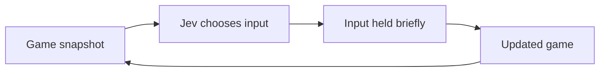

I've been giving an AI model ten possible inputs and asking it to choose which one to hold in a little game I made with the kids. It needs to catch wandering toys in bubbles, pick them up and return them to monster hotel guests. While it's deciding, the toys keep moving.

The model is [Jev, from TypeSafe](https://typesafe.ai/blog/introducing-system-one-models-and-jev), which is in public early access. It's a decision model: rather than asking it to write a chat response about what it might do, I give it a typed question and a set of choices. I wanted to try that with something where the answer becomes an input, and the next decision depends on what happened in the game.

<video controls preload="metadata" playsinline poster="jev-playing-poster.webp" aria-label="Jev playing Monster Hotel">
  <source src="jev-playing.mp4" type="video/mp4">
  <p>Your browser doesn't support embedded video. <a href="jev-playing.mp4">Watch the demo.</a></p>
</video>

*Jev playing Monster Hotel, with its decisions visible in the panel alongside the game.*

## The Game We Made

I haven't written about [Monster Hotel](https://benpearson.dev/monster-hotel/) here before. I spent time with the kids working out the assets, the style, the music and what the game would actually do, and they had lots of fun with it. I used [Nano Banana](https://gemini.google/overview/image-generation/) to generate the images and [Gemini](https://gemini.google.com/) to create the music. The game itself was written with GPT-6 Astra, using [Phaser 3](https://phaser.io/).

There are three guests: Pip, a slime who wants teddy bears; Yoyo, a yeti who wants pillows; and Moss, a bath monster who wants ducks. Each wants two toys, so six deliveries finishes the game. There's no timer and no losing.


*The pink backgrounds were colour keys, removed from the Nano Banana originals to make transparent sprites.*

The artwork covers the lobby, helper, guests and toys. Bubbles, shadows, glowing doorways and celebrations are drawn in Phaser code rather than supplied as images. The music is a separate file, with synthesised chimes for effects.

To make a delivery, you catch a toy in a bubble, walk into it to pick it up, then carry it to the correct guest's glowing doorway. You can only carry one toy, and you can't shoot while carrying it. Those rules give Jev a few different things to work out, even in a game without much pressure: catching something moving, reaching it, then stopping the hunt long enough to deliver it.

## Giving Jev The Controls

The browser calls [OpenRouter](https://openrouter.ai/) directly, using `typesafe/jev-1.13` through its decision endpoint. I'm not sending screenshots. I send numerical game state alongside the rules, and ask Jev to choose an action.

The snapshot includes the player's position, facing and carried toy; toy positions, velocities and whether they're free or caught; guest goals and delivery counts; bubbles, shooting cooldown and recent outcomes. That goes into a string containing rule prose and serialised state.

There are ten choices: `up`, `down`, `left`, `right`, `stay`, and a `_shoot` version of each. Moving changes the direction you're facing, so `up_shoot` moves and fires upwards. Staying still and shooting uses the direction you're already facing.

Here's an illustrative request with just one toy, one guest and three choices. For readability, I've shown the decoded `state` as an object; the API actually receives it as a string containing the rules and this serialised data:

```json
{
  "model": "typesafe/jev-1.13",
  "state": {
    "score": 0,
    "player": {"x": 500, "y": 600, "facing": {"x": 0, "y": -1}, "carried": null},
    "toys": [{"item": "teddy", "x": 500, "y": 480, "state": "free", "velocity": {"x": 15, "y": 0}}],
    "guests": [{"name": "Pip", "item": "teddy", "x": 210, "delivered": 0}],
    "bubbles": [], "bubbleCooldownMs": 0,
    "decisionContext": {"phase": "catch"}
  },
  "questions": {"action": {
    "type": "choice", "instructions": "Choose the next input.",
    "criteria": {"up": "Move up", "up_shoot": "Move up and shoot", "stay": "Wait"}
  }}
}
```

A matching illustrative response supplies the selected input and a confidence estimate:

```json
{
  "answers": {"action": {"choice": "up_shoot", "confidence": 0.82}}
}
```

The actual request includes more state and rules, and the action descriptions contain geometric forecasts: the projected end position, whether a move gets closer to the goal, and potential catches from shooting. The game code also supplies the current task, whether that's catching, collecting or delivering, and the relevant destination. Jev chooses the next input, but it isn't working out the whole plan or physics from scratch. I'm testing it as part of a controller, not running a benchmark of unaided game-playing.



By default, the chosen input is held for 250 milliseconds, then released before taking a new snapshot. The loop awaits each decision rather than polling at a fixed rate, but gameplay continues while the request is in flight. A toy can have moved by the time the answer arrives. If the score or carried item changes, the loop cancels the stale decision rather than applying it to that changed situation.

## What A Run Costs

Jev can get through the game in around 60 requests. [TypeSafe's advertised pricing](https://typesafe.ai/blog/introducing-system-one-models-and-jev) is $0.042 per million input tokens, with no charge for output. If I allow roughly 5,000 input tokens per request for the rules, game state and forecasts, that's 300,000 tokens for a run: **about $0.013, or 1.3 US cents for the whole game**.

That's a back-of-the-envelope estimate, not a measured bill. Request sizes and retries vary, and OpenRouter's billing may differ from TypeSafe's advertised rate. The panel reports the API's usage and cost totals, so I can check what a particular run actually cost. The rough figure is enough to explain part of the appeal for me: I can try lots of small decisions without running up much of a bill.

## Watching The Decisions

I've included an inspector because I want to see the exact request and response alongside what actually happened. The **Requests & responses** button opens it, or you can click a decision in the log to inspect that call. You can expand the terminal for more room, and download the latest 200 calls. It gives me a way to separate a questionable choice from an input that arrived after the situation had moved on.

You can [try the Jev mode here](https://benpearson.dev/monster-hotel/?ai=1), using your own OpenRouter key. The panel can optionally keep it in session storage; otherwise it's held in browser memory. It isn't embedded in the shipped game or included in exports, and there's no server proxy. Browser scripts and extensions can still access a key, so I'd use a separate one with a small spending limit.

The [normal game](https://benpearson.dev/monster-hotel/) needs no key or API calls. The [source is on GitHub](https://github.com/hoombar/monster-hotel-bubble-trouble).

I'm interested in this as a real-time decision task, where an answer has to become a short movement and then be checked against the changed game. I don't have a claim about Jev reliably completing it. For now, I want to look at the choices it makes, how much the forecasts help, and where the moving state makes an otherwise reasonable input wrong.
