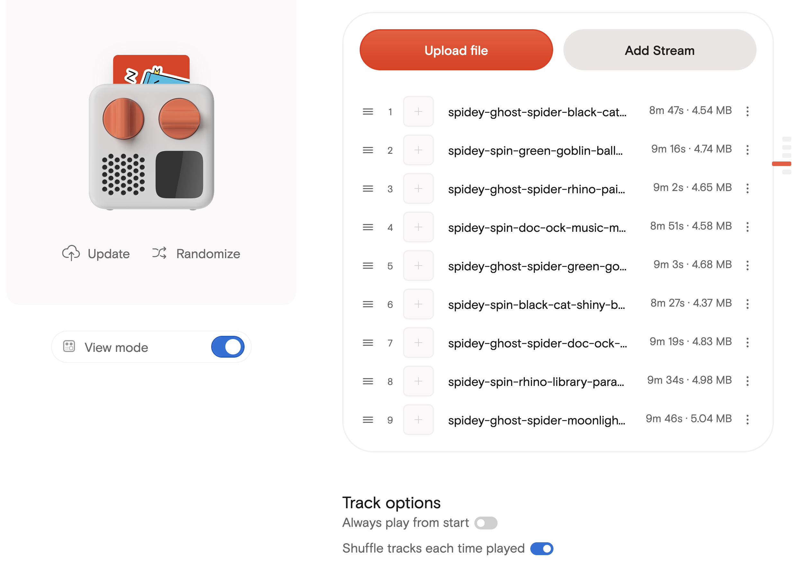

I wanted a very small thing: more Spider-Man stories for my son to listen to on his [Yoto](https://yotoplay.com/) player.

My daughter had a podcast called Curious Kids loaded onto a Yoto card, and it worked really well. She could put the card in, listen by herself, and get a familiar stream of short audio without needing a screen. My son already had a Spider-Man Yoto card, but he wanted more stories.

There are Spider-Man audio stories out there, but the ones I found were not quite right for a four-year-old. Some were too old, too intense, or just not the gentle bedtime-ish tone I wanted. So instead of trying to find the perfect thing, I made a bunch of private Spider-Man stories for him.

The goal was not really a podcast. It was a Yoto card full of stories he could actually listen to. A workflow where I could ask for a few gentle superhero stories, render them with expressive voices, and end up with MP3 files that were nice enough to load onto the card.

The surprising bit is how quickly it stopped being a prompt-writing problem and became a systems problem.

The first version of this could have been one prompt that said "write a kids story" and another prompt that said "turn it into audio". That would have produced something, but probably not something I would want to keep using. The useful version needed a schema, voice boundaries, ignored secrets, renderer behaviour, validation checks, and enough early listening to bake the right defaults into the workflow.

By the time it felt worth writing about, the project had nine complete story JSON files and nine rendered MP3s, each with a matching WAV file for checking the audio. I have also managed to load them onto a Yoto card for him. That is still small, but it is enough to expose the real design questions. One story can be a prompt. Nine stories start to need a workflow.

## The Output

Before getting into the machinery, this is one of the generated stories. It is about nine minutes long, rendered from JSON with a narrator voice, Spidey, Spin, and Green Goblin.

<audio controls preload="metadata" style="width: 100%;">
  <source src="spidey-spin-green-goblin-balloon-bonanza.mp3" type="audio/mpeg">
  Your browser does not support the audio element. You can <a href="spidey-spin-green-goblin-balloon-bonanza.mp3">download the MP3</a> instead.
</audio>

_[Download the MP3](spidey-spin-green-goblin-balloon-bonanza.mp3) if the embedded player does not work._



_The generated MP3s loaded onto a Yoto Make Your Own card. This is the actual endpoint I cared about more than a general podcast feed._

I like putting the output first here because it makes the rest of the post less abstract. The interesting question is not whether a model can write a children's story. It obviously can. The question is what small bits of structure, rendering, and validation make the result repeatable enough that I can ask for another story and get a usable MP3 out the other end.

## The Shape Of The System

The workflow currently looks like this:

1. Ask for a story with a theme, cast, and target age.
2. Generate a JSON script using the story generation skill.
3. Validate the JSON structure, speaker names, voice labels, and no-SFX rule.
4. Render the story with the ElevenLabs renderer.
5. Check the MP3 and WAV outputs.
6. Upload the MP3s to the Yoto card.

That is the current steady-state version. Earlier on there was more tuning involved, but at this point the prompt rules and renderer are in good enough shape that I can ask for another story and get an MP3 out the other end.

There are two important boundaries in that workflow.

The first is the story JSON. The generator does not produce prose that I then manually copy into a TTS tool. It produces structured data: a title, a cast, and a list of speakable segments. Each segment has a `speaker`, a semantic `voice`, spoken `text`, and a `pause_ms` value.

The second is the voice config. The story says `warm_narrator`, `bright_child_hero`, `confident_child_hero`, or `silly_mischief_villain`. It does not contain real ElevenLabs voice IDs. Those live in a local ignored config file. The story stays portable and safe to commit; the machine doing the rendering knows how to map the semantic labels onto actual voices.

That separation turned out to be the part that made the project feel less fragile.

## The JSON Boundary

The story files are deliberately boring. A shortened version looks like this:

```json
{
  "title": "Spidey and the Balloon Bonanza Plan",
  "target_age": 5,
  "estimated_duration_minutes": 10,
  "word_count_target": "1250-1500",
  "story_lesson": "A plan keeps a fun surprise from floating away.",
  "cast": [
    {
      "speaker": "narrator",
      "display_name": "Narrator",
      "voice": "warm_narrator"
    },
    {
      "speaker": "spidey",
      "display_name": "Spidey",
      "voice": "bright_child_hero"
    }
  ],
  "segments": [
    {
      "speaker": "narrator",
      "voice": "warm_narrator",
      "text": "The city playground was getting ready for Thank-You Helper Day.",
      "pause_ms": 650
    }
  ]
}
```

The renderer can validate that every segment speaker exists in the cast, that the voice label matches, and that each segment has the fields it needs. I can also run simple checks over the whole `examples/` folder: no `sfx` fields, no obvious dialogue labels inside character segments, no quoted dialogue hiding inside narrator segments.

That last point sounds fussy, but it mattered a lot for the audio.

If the JSON has a character segment like this:

```text
Spidey said, "I've got it."
```

then the Spidey voice reads the words "Spidey said". That sounds wrong immediately. The better structure is:

```json
{
  "speaker": "narrator",
  "text": "Spidey pointed to the balloon and said."
}
```

followed by:

```json
{
  "speaker": "spidey",
  "text": "I've got it."
}
```

The narrator carries the attribution. The character voice only speaks the line.

> Once the output is audio, text that looked harmless in JSON can become very obviously wrong.

That became one of the core prompt rules for the story generator: dialogue labels belong in narrator segments, not character segments.

## Narrator-Led Worked Better

The other prompt rule that mattered was pacing.

My first instinct was to use lots of character dialogue, because multiple voices are the fun part of a TTS story. In practice, constant speaker changes made the story feel choppy. The better version is narrator-led, with character voices used as highlights.

That is especially true for a young listener. Voice differences are not enough. The story still needs to make speaker identity obvious in the spoken text. The narrator can say "Ghost-Spider picked up the ribbon list and said", and then the Ghost-Spider voice can deliver one clear line. That is slower on the page, but much easier to follow in audio.

The current stories are probably more narrator-heavy than I would choose for an adult audio drama. The latest batch came out around 87-91% narrator by word count. But for this specific use, that tradeoff sounds better than a rapid-fire script. It is closer to a parent reading a story with occasional character voices than a cartoon episode trying to reproduce every beat in dialogue.

## The Renderer Became A Product Boundary

The renderer started as the mechanical bit: read JSON, call TTS, concatenate audio.

In the repo, that lives as a normal command-line tool rather than a notebook or one-off script. The command shape is roughly:

```bash
kids-podcast-render-elevenlabs \
  examples/spidey-spin-green-goblin-balloon-bonanza.json \
  output/spidey-spin-green-goblin-balloon-bonanza.mp3 \
  --voice-config config/elevenlabs-voices.local.json \
  --output-wav output/spidey-spin-green-goblin-balloon-bonanza.wav
```

The API key comes from a local `.env` file, and the real voice mapping comes from the ignored local config. The example config in the repo shows the shape without exposing the actual voice IDs I am using.

It quickly picked up more responsibility:

- It speaks the top-level `title` first.
- It inserts a two-second pause after the title.
- It maps semantic story voices to local ElevenLabs voices.
- It applies per-voice volume adjustments.
- It adds short fades between segments.
- It writes both MP3 and WAV outputs.

The title handling is a small example of a useful boundary. I do not want every generated story to include a manual first segment that says the title. That would mix presentation behaviour into the story content, and it would be easy for the generator to get wrong. The story has a `title`; the renderer knows titles should be spoken first.

The same is true for volume. Spidey sounded louder than the narrator, so I adjusted the Spidey voice down in the local voice config rather than rewriting every story. That is the sort of practical fix that becomes much easier once the story data and rendering behaviour are separate.

## What I Removed

One of the more useful decisions was removing generated sound effects.

The early workflow allowed `sfx` cues in the story JSON. That seemed sensible on paper. A web whoosh here, a soft pop there, maybe some city ambience under the opening. ElevenLabs has sound generation, and the idea of a more produced story is appealing.

In practice, the generated effects were not good enough for this use. They added another thing to prompt, render, cache, mix, and review, while making the final output less predictable. The voice quality was the part that made the stories work. The SFX were mostly a distraction.

So I took them out of the story workflow. The renderer still has some old SFX-shaped configuration around the edges, but the actual generation rule is now voice-only.

> The best automation change was not adding another capability. It was deciding which capability should not be in the loop.

That is a pattern I keep running into with agent workflows. The tempting version is to keep expanding the system until it can do everything. The more useful version is often narrower and more opinionated.

## Secrets, Outputs, And Safe Files

The repository is private, but I still treated it as if the boundaries mattered.

The safe things to commit are the code, examples, README, and example config files. The unsafe or local things are ignored:

- `.env` for the ElevenLabs API key.
- `config/*.local.json` for real voice IDs and tuning.
- `output/` for generated MP3 and WAV files.
- package metadata and generated audio cache files.

That means a story JSON file can be reviewed, committed, and shared inside the repo without dragging credentials, purchased voice choices, or large generated files along with it.

The rendered files are treated as outputs rather than source. After rendering, I verify the WAV files for duration, peak amplitude, and clipped samples. The latest four stories came out like this:

| Story | Duration | Peak | Clipped samples |
|---|---:|---:|---:|
| Music Machine Mix-Up | 531.80s | 0.9087 | 0 |
| Paint Parade Pause | 542.20s | 0.8916 | 0 |
| Balloon Bonanza Plan | 556.82s | 0.9009 | 0 |
| Starlight Skate Surprise | 527.49s | 0.9359 | 0 |

That check is not a full listening review, but it catches the basic mechanical failures. Is the file roughly the expected length? Did concatenation work? Did anything clip? Are the outputs mono at the expected sample rate? It is the boring verification layer that makes the fun output easier to trust.

## From Tuning To Reuse

There was a tuning phase while I was building this, but that is not really the day-to-day workflow any more.

Early on, I did need to work out where each kind of problem belonged. If the story had stiff dialogue, that was a generation rule. If speaker labels were being read in the wrong voice, that was a JSON segmentation rule. If one character was louder than the narrator, that was a voice config issue. If every story needed the title spoken first, that belonged in the renderer. If generated SFX were making things worse, that was a scope decision.

Those decisions are now mostly baked into the skill, renderer, and local config. The normal workflow is much simpler:

1. Ask for another story.
2. Save the generated JSON.
3. Validate it.
4. Render it with [ElevenLabs](https://elevenlabs.io/).
5. Upload the MP3 to the Yoto card.

That is the bit I like. It no longer feels like I am hand-tuning a prompt every time. It feels like a small tool I can use.

I also kept [Kokoro](https://github.com/hexgrad/kokoro) as a local fallback renderer. ElevenLabs is much better for the expressive version of the stories, but having a local path is still useful for testing the shape of the workflow without spending API calls or depending on a remote service for every experiment.

Kokoro was actually where I started. It was appealing because it is local, free to run, and good enough to prove the basic pipeline. I could generate a story, split it into segments, render the voices, and produce a finished MP3 without depending on a paid API.

But the stories felt a little boring. The voices were clear, but they did not carry enough expression for this kind of children's story. A silly villain needs to sound silly. A narrator needs warmth. Spidey needs a bit of bright energy. Without that, the workflow was technically working, but the output did not have the feeling I wanted.

Switching to ElevenLabs changed that. The voice variety was much better, and the characters could sound distinct without the script doing all the work. That did not remove the need for good segmentation or narrator-led pacing, but it made the final stories feel much more alive.

## What I Would Improve Next

There are a few obvious next steps.

The first is deciding whether it is worth automating delivery any further. Right now the useful endpoint is a Yoto card, and that already works. If I wanted to add a lot more in the future, I could set up an RSS feed and generate new stories on a cron job, but that is deliberately not the starting point. The starting point was getting a handful of good MP3s onto the card.

The second is better review metadata. I would like a small manifest that records the story file, render date, voice config version, duration, peak, and whether I listened to it. The MP3 is the output, but the review state is the thing that would make this easier to manage over time.

The third is being careful not to over-improve it. The current narrator-led structure works well. The narrator ratio is probably higher than it needs to be, but I would rather leave a working pattern alone than chase a fixed percentage and accidentally make the stories worse.

The fourth is deciding how public any of this should be. The code could be useful as a pattern, but the actual use case is private family material, with private voice config and stories written for a specific child. That boundary is worth keeping clear.

## The Bit I Like

What I like about this project is not that it uses AI to make stories. That is the obvious part.

The more interesting bit is that it became a tiny production system around a personal use case. The AI writes the structured story. The renderer owns presentation details. The local config owns real voices and tuning. The validation scripts catch mechanical mistakes. The Yoto card is the delivery path.

That is the shape I keep finding useful with AI tools: not one impressive prompt, but a small system where the model, files, scripts, and final destination each have a clear job.

For something as silly as a private superhero story card, that might sound like over-engineering. But it is also why the output is good enough that I want to make more of it.
