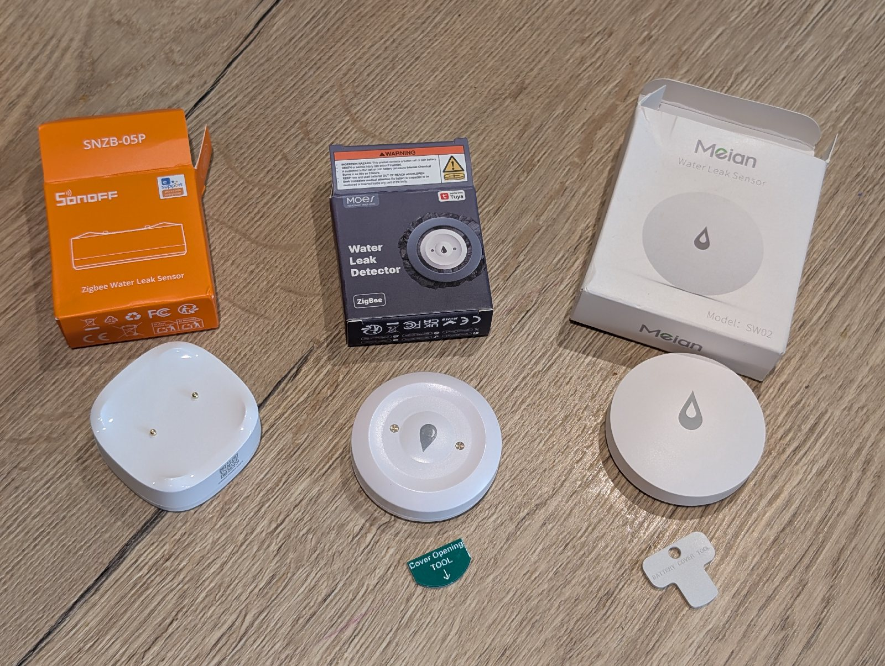
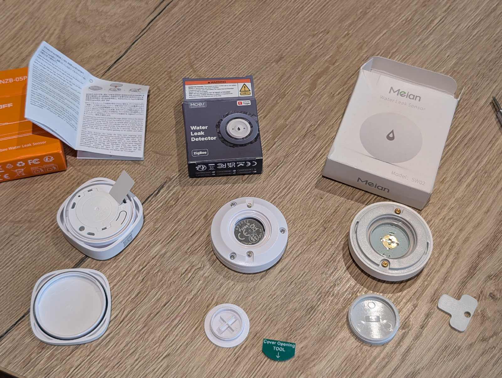
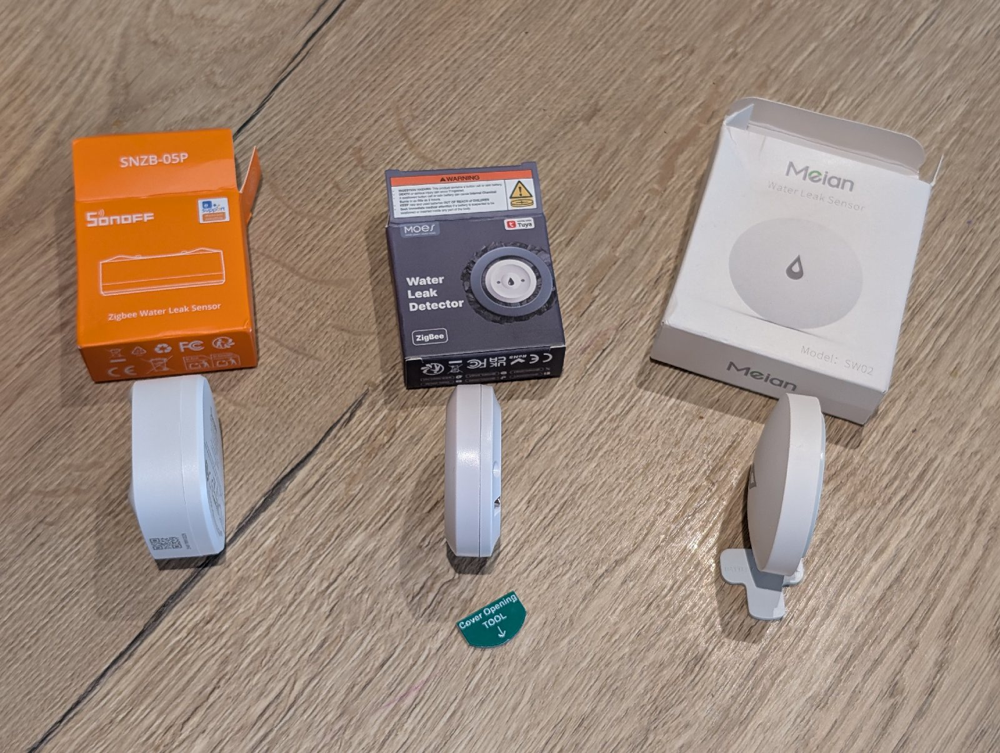
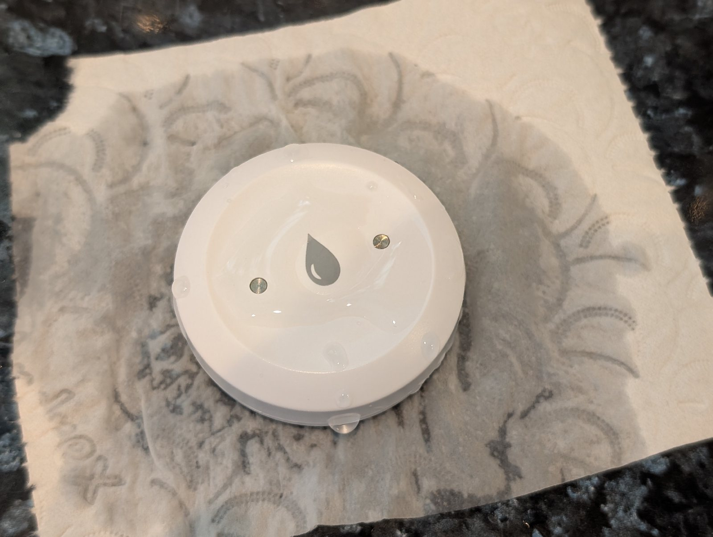
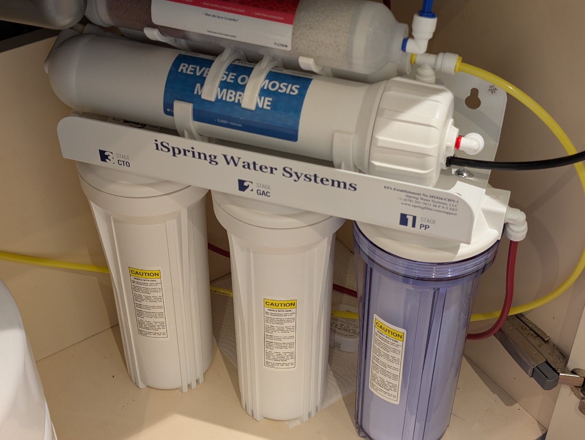
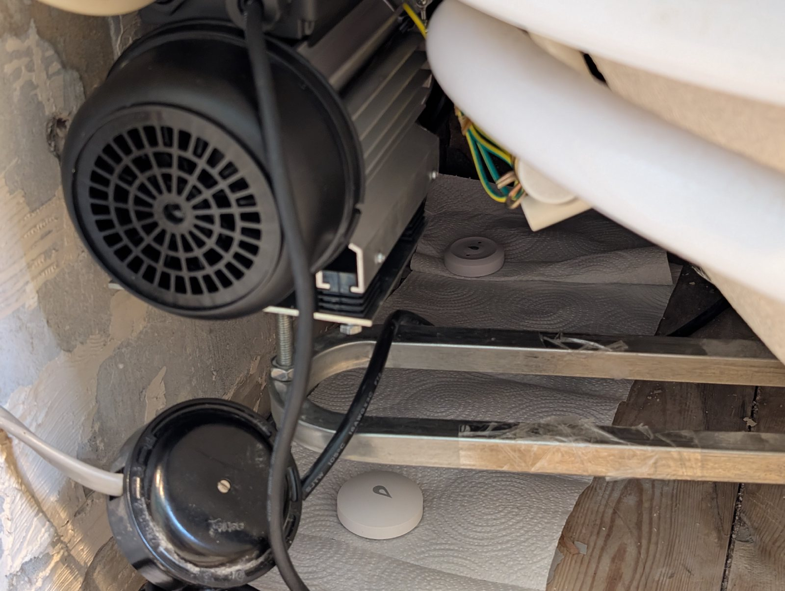

I bought three leak sensors because there are a couple of places in the house where I would rather get an annoying phone notification than discover a slow leak much later.

The first place is under the kitchen sink, next to the reverse osmosis system we use for filtered water. The second is under the bath, where I recently fitted a replacement pump for our whirlpool bath. Both are exactly the sort of places where a small leak can sit quietly for a while before it becomes obvious.

I ordered one sensor from [Sonoff](https://s.click.aliexpress.com/e/_c3lEFl6H), one from [Moes](https://s.click.aliexpress.com/e/_c3Mk6Pa5), and one from [Meian](https://s.click.aliexpress.com/e/_c4MhRYEt). This is not a careful long-term review yet. It is more of a first setup note: what Home Assistant saw, where I placed them, and the small trick I used to make them more likely to notice a drip.



_The three sensors from the front. They are all doing the same basic job, but the shape and thickness are slightly different._

## The Sensors

All three sensors exposed the same basic thing in Home Assistant: a binary `water leak` value. If the contacts are dry, it is false. If water bridges the contacts, it becomes true.

That is the important bit. I do not need a percentage, a moisture level, or a clever classification. For these locations, the useful question is very simple: is there water where there should not be water?

The differences were small but still worth noting.

| Sensor | Leak detection | Tamper detection | Battery note |
|---|---|---|---|
| Sonoff | Yes | No | Battery included |
| Moes | Yes | Yes | Battery included |
| Meian | Yes | Yes | Needed a CR2045 |

The Meian sensor did not come with a battery, so I had to open it up and put one in. Luckily I already had a CR2045 kicking about, otherwise that would have been a slightly annoying pause in the setup.



_The Meian sensor was the awkward one here because it arrived without a battery. The others were ready to pair once opened._



_Side-on, the difference in thickness is easier to see. It is not a huge issue, but it can matter if the sensor needs to sit under pipework or in a tight corner._

## Tamper Detection Is More Useful Than I Expected

The Sonoff sensor only gives me the leak state. The Moes and Meian sensors also expose a tamper sensor, again as a simple boolean.

At first that sounds like a security feature, and in this use case I do not really care if someone is trying to steal a leak sensor from under the bath. But the more practical use is position.

A leak sensor is only useful if it is still sitting in the place where a leak would actually reach it. If it gets knocked, moved, or lifted out of the little low point where I placed it, then the automation can still look healthy while the physical setup has stopped making sense.

> The leak state tells me whether the sensor is wet. The tamper state can tell me whether I should still trust where the sensor is sitting.

I have not yet built anything elaborate around the tamper sensors, but I can see the shape of it: if a sensor is tampered with, send a notification saying it may have moved and might not detect a leak reliably. That is a much more useful alert than treating tamper as only a security event.

## The Kitchen Tissue Trick

For both locations I placed the sensors on kitchen tissue.

That is not because the sensors need cushioning. It is because a tiny drip can be surprisingly local. If a single drop lands a few centimetres away from the sensor contacts, the sensor may not know anything has happened until enough water builds up and spreads naturally.

Kitchen tissue changes that. A drip landing on the tissue spreads along it, which gives the water a better chance of bridging the sensor contacts early.



_The tissue is there to help a small drip travel. It is a very basic way of making the sensor less dependent on water landing in exactly the right spot._

It is a low-tech addition, but it makes sense for the kind of leak I am trying to catch. I am not really worried about a pipe bursting dramatically. I am worried about a push-fit connection, pump seal, or pipe joint slowly weeping somewhere awkward.

## Under The Sink

One sensor went next to the reverse osmosis system under the kitchen sink.

The RO system has push-fit connections, and although they are common and usually fine, I do not really trust them not to leak over time. That might be unfair, but it is exactly the kind of small risk that a cheap leak sensor is good at covering.

I placed the sensor on kitchen tissue near the pipework so that if a drip starts, the tissue should help the water travel to the contacts rather than waiting for the whole area to become wet.



_This is the one next to the reverse osmosis system under the sink. The push-fit connections are the bit I want early warning on._

This is probably the neatest use case for these sensors. The area is enclosed, there is plumbing I cannot see during normal use, and the consequence of missing a slow leak is much worse than the consequence of a false alarm.

## Under The Bath Pump

The bath pump setup is the more personal one, because I fitted the replacement pump myself.

For some reason, the plumbers I spoke to did not seem keen to touch it. They made it sound more complicated than it turned out to be, so in the end I replaced it myself. It works, but that does not mean I completely trust my own plumbing work to stay perfect forever.

I used sealant around the pipes, especially near the connection by the heater, but I still wanted something watching it over time. The bath is also a larger area than the RO system, with more possible leak points, so I put two sensors under there rather than one.

One sits under the pump itself. The other sits further back near the heater connection, where I used the sealant.



_Under the bath I used two sensors because the area is larger and there are a few different places that could leak._

Again, both are on kitchen tissue. The goal is to catch small drips before they become a damp patch, not to wait until there is enough standing water to make the detection obvious.

## The Home Assistant Automation

The Home Assistant side is deliberately boring.

Each sensor exposes a binary `water leak` value. If any of those leak sensors changes to true, Home Assistant sends a notification to me and my wife so we both get it on our phones.

The automation is not trying to be clever about severity or location yet. I mostly want the fast path to work:

```text
leak sensor becomes wet
  -> Home Assistant sees water leak = true
  -> phone notification goes to both of us
  -> go and check the physical location
```

That is enough for this first version. A leak is one of those automations where I do not want a lot of interpretation in the middle. If the sensor thinks there is water, I want to know quickly and decide what to do myself.

## First Impression

For a small setup, I like this more than I expected.

The sensors are not doing anything complicated, but that is probably why they are useful. They turn a hidden physical problem into a simple Home Assistant state, and that state is easy to notify on.

The only thing I would think about more carefully if buying again is tamper detection. I would not treat it as essential everywhere, but for leak sensors that can be knocked out of place, it is a more practical feature than I first gave it credit for.

The next version of this note could do with a bit more detail after the sensors have been sitting in place for a while. For now, the important part is done: the places I do not fully trust are the places that will shout at me if they get wet.

_Some of the product links in this post are affiliate links._
