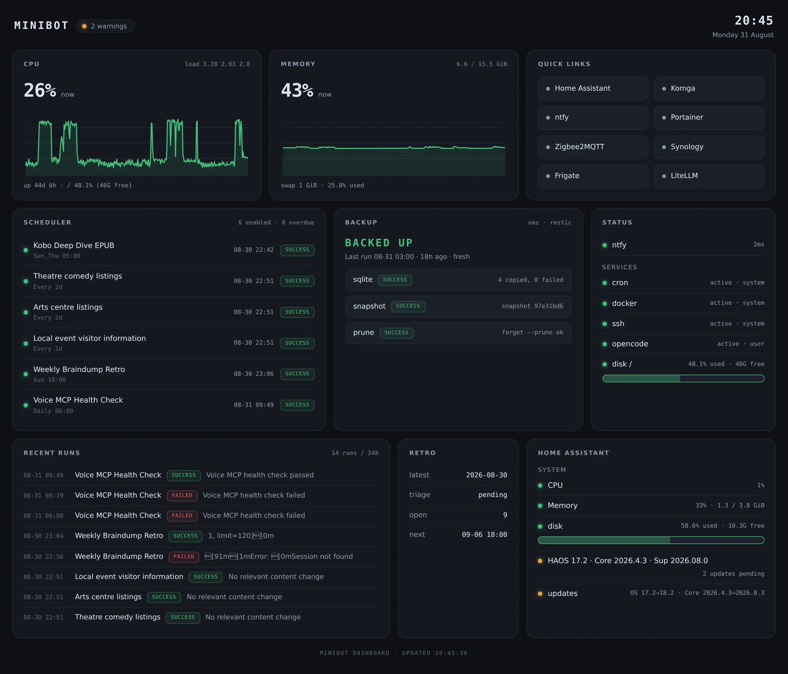
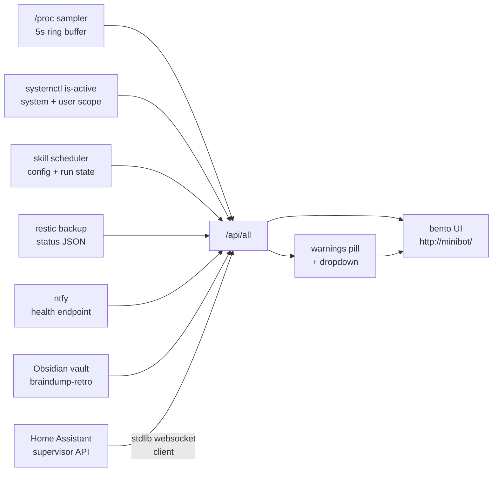
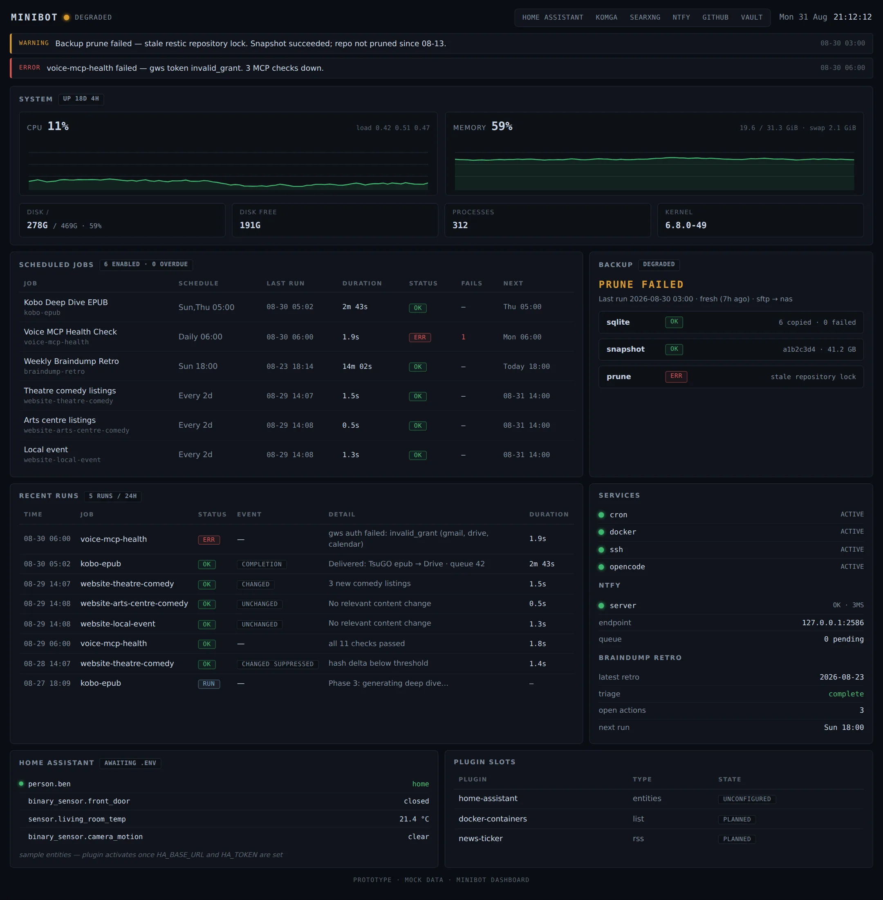
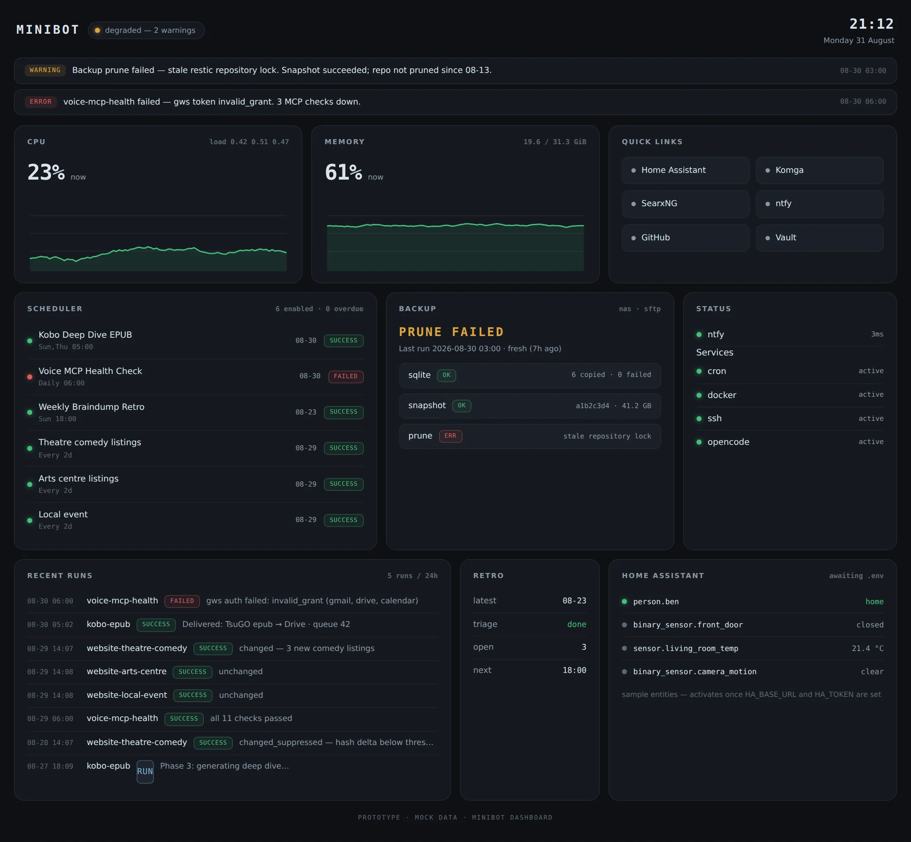

A while back I couldn't log in to my own mini PC. OpenCode had locked up on `minibot` and filled the disk, and I had no idea until it stopped accepting SSH sessions. The fix was the annoying kind: clear enough space to breathe, restart things, work out afterwards how long it had been sitting like that.

If you've read [the post about moving my coding agents onto a headless box](/writing/stop-carrying-the-agent-around/), you know the machine: `minibot`, a small GMKtec mini PC running Ubuntu Server, the always-on development machine on my home network.

The disk was the worst of it, but it had company. Something once ate all the memory, and I only noticed when things got slow and strange. Services had stopped running, and I found out when I went to use them, which is the worst possible time to find out. And a scheduled skill failed while ntfy - my push notification service - never told my phone, so the thing I'd set up to catch failures had failed too.

> The problem was never one bad failure. Everything failed quietly, and quiet failures only surface when you go looking.

And of course I never went looking. Nobody logs into a healthy server to admire it. I had alerting on that box, and the one time I needed it, it stayed quiet. What I wanted was one page I could open in two seconds that would tell me honestly whether anything needed attention.

## What It Watches

The dashboard is a read-only operations page on my LAN at `http://minibot/`, run as a systemd service. The frontend pulls one JSON payload every 30 seconds, with a faster five-second poll just for the system charts. Behind it are collectors, each a small module with one job:

- **system** samples `/proc/stat`, `/proc/meminfo`, `/proc/loadavg` and `/proc/uptime` every five seconds into a ring buffer, about three hours of history for the CPU and memory sparklines, and checks disk against warn and error thresholds at 75% and 90%.
- **scheduler** reads the skill-scheduler config and run state files, and flags overdue jobs, jobs stuck in "running", and unusual run rates, including site-change watches for a few local venues and events.
- **backup** reads the status JSON my [restic](https://restic.net) script writes after each phase - sqlite, snapshot, prune - with log parsing as a fallback. A failed prune marks the whole run degraded, never success, and a status older than 26 hours counts as stale.
- **ntfy** is a health check on the local [ntfy](https://ntfy.sh) container - as I learned the hard way, the notification service is itself something that can break.
- **services** runs `systemctl is-active` across a configured list - cron, docker, ssh, opencode - checking the system scope, then the user scope.
- **retro** pulls the latest braindump-retro state from my Obsidian vault: last run date, triage status, open items, next run.

[Home Assistant](https://www.home-assistant.io) runs on a separate box, and it's the one I most often forget to check. Python's standard library has no websocket support, so the plugin ships a hand-rolled 235-line websocket client that speaks to the HA supervisor API, authenticated with a long-lived token from a gitignored `.env` file. It surfaces HA's own disk, CPU, memory, SSD wear and pending updates, and raises warnings when disk or memory go over 90% or updates are waiting. Both machines now get checked from one page.



_Most days every tile is boring, which is the point._

The data flow looks like this:



## Design Choices That Matter

The whole thing is Python 3 standard library: no pip dependencies, no build step, nothing to rebuild after a year of neglect. About 1,670 lines in a private repo: a 69-line `server.py`, the collectors, and a static frontend of vanilla HTML, CSS and JS.

> The thing that watches the server has to survive neglect better than everything it watches. Stdlib-only is the whole strategy: no dependencies to rot, no build to forget, nothing to quietly break while I'm not looking.

The obvious alternative is a Prometheus and Grafana stack, and that's a fine answer, but it's also another few services to babysit, and babysitting services was the problem I was trying to get out of.

It's also read-only by design: collectors sample `/proc` and state files, and nothing writes back or restarts services. Plugins can't crash the page either - the loader catches exceptions per plugin, so a broken plugin shows up as a warning instead of a blank page. The contract is deliberately boring:

```python
def collect(ctx: dict) -> dict:
    ...
    return {
        "configured": True,
        "warnings": [],
    }
```

Drop a `.py` file into `plugins/`, expose `collect(ctx)` where `ctx` carries config and env, and return state plus any warnings. All warnings roll up into a single pill in the header, with a dropdown listing everything that needs attention. Right now the pill says two: a retro triage I haven't marked complete, and a set of pending Home Assistant updates.

The one fiddly bit is port 80, which is privileged on Linux and usually means running the service as root. I didn't want that, so the unit runs as my normal user with exactly one capability granted:

```ini
[Service]
User=ben
Restart=on-failure
AmbientCapabilities=CAP_NET_BIND_SERVICE
CapabilityBoundingSet=CAP_NET_BIND_SERVICE
```

`AmbientCapabilities` grants just enough to bind the port, `CapabilityBoundingSet` caps the unit at that and nothing more, and `Restart=on-failure` covers the crash case.

## Two Complete Designs For Pennies

Before wiring anything to live data, I had the model build two complete prototypes against mock data: a dense "ops console", all rows and monospace numbers, and a bento grid of tiles. I put them side by side, picked the bento grid, and threw the other away without a second thought.

<div class="img-pair">
  
  
</div>

_The losing ops console and the winning bento grid, built before either touched live data._

That's the part I'd have skipped on any other project: building two full UIs to keep one only makes sense when the cost is pennies, and the losing design bought a real decision instead of a guess.

Then the bento grid got wired to the live API, and the iterations kept coming: warnings moved into the dropdown, a disk usage bar was added, and the mobile layout got fixed so tiles stack and rows shrink safely.

## What $0.70 Actually Bought

The entire build cost less than $0.70 of [GLM-5.3-Flash](https://z.ai), z.ai's model, run through [OpenCode](https://opencode.ai): both prototypes, the wiring, the mobile fixes, and the troubleshooting in between. Twenty-one commits over two days.

The number itself doesn't matter much. What's changed is which constraint is gone. Model cost has stopped shaping decisions on a project like this: I don't budget prompts, and I don't hesitate to ask for a second design I might throw away. The expensive part is the same as it ever was - knowing what to build, what to check, and when the thing in front of me is actually done.

## The Part I'm Still Thinking About

The dashboard is pull-based. It doesn't chase me. Nothing pings my phone; I have to open the page. On paper that sounds like the flaw - I built this because I don't go looking, and now the fix depends on me going looking.

In practice it's worked better than I expected, because checking has become nearly free. Opening a tab takes seconds, so I actually do it - over coffee, while a build runs, whenever I walk past, from my phone over the VPN. The quiet-failure problem never needed zero attention, just very cheap attention. And the first thing this page would have caught is the disk-fill that started all of it.

The obvious next step is to point ntfy at the warning list so the page chases me too. The plumbing is already on the box, watched by its own health check. I've been slow about it on purpose: push alerting is what burned me in the first place, and a channel that stays silent while things break is worse than no channel, because it teaches you to stop trusting it. So for now the page stays pull, I do the pulling, and the trust rebuilds from actually looking.

Whether that holds overnight - when I'm asleep and something fills a disk - is still open. And a monitor that watches everything should probably eventually watch itself. Neither feels urgent yet, which is probably a sign I should stop writing and go look at it.
