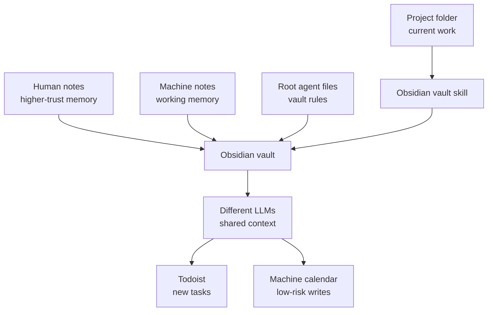

I kept finding myself doing the same small handoff between LLMs: copying context out of one place, restating the decision in another, and hoping I had not left out the bit that made the answer make sense.

A coding agent knows what happened inside a repo, but not the useful decision I made in another project last week. A chat session can help me work through a thought, but the result often stays trapped in that chat. Another LLM can pick up the next task, but only if I manually carry the context across.

I do not want one giant memory system that silently decides what matters about my life. I want something plainer than that: a shared working memory that different LLMs can use, that I can inspect, and that has clear boundaries around what the machine is allowed to do.

For me, that shared memory is an Obsidian vault.

> The useful bit is not that an LLM can read my notes. It is that different LLMs can meet in the same memory system without needing to be the same LLM.

## The Vault Is The Shared Surface

The vault is not just a place where I keep personal notes and occasionally let an agent browse around. It is part of the interface between me, the tools, and the models.

There are agent files in the root of the vault. That matters because the vault has its own rules, separate from any one software project. A coding agent working in a repo can have project-specific instructions, but the vault needs instructions that travel across projects. The root agent files give LLMs a way to understand how to behave around the notes: where to look, what to update, how to treat different folders, and what not to assume.

The vault also has a simple split between a `human` folder and a `machine` folder.

That split does a lot of work. Human notes are the higher-trust layer. Machine notes can still be useful, but they are not pretending to have the same status. If an LLM captures a rough summary, leaves a working note, or records something from a session, it can go into the machine side without polluting the human side of the vault.

This keeps the system more usable because I do not have to choose between two bad options: either never let the machine write anything, or let machine-written notes blend into the same space as notes I wrote and endorsed myself.

## Project Memory Without Project Lock-In

The other important piece is the Obsidian vault skill.

A lot of useful memory does not belong inside a project folder. It might be a preference about how I like writing tasks handled, a running thread that spans several repos, a note about a recurring admin workflow, or context that is useful to more than one LLM tool.

Project folders are good for project facts. They are bad for cross-project memory.

The vault skill gives a project a controlled way to use Obsidian as memory outside its own folder. That means a coding agent can be working in a repo, but still know that there is a broader memory system available when the task calls for it. The project does not need to copy shared knowledge into itself, and the vault does not need to become tangled up with the project's source tree.

The boundary is the important part. The vault is shared memory, not just another directory inside the current project.

## Front Matter Makes Notes More Than Text

The notes have front matter.

That sounds like an implementation detail, but it is one of the things that makes the system work better for agents. Plain Markdown is good because it stays readable by humans and tools. Front matter adds a small amount of predictable structure without turning every note into a database record.

It gives the system somewhere to put metadata: what kind of note this is, where it came from, whether it was machine-written, what project or area it relates to, and whatever else is useful for retrieval. The exact schema can change over time, but the point is that an LLM does not have to infer everything from prose.

This matters most when the vault is being used by different tools. One LLM might create a note, another might later search for it, and a third might summarise it into a project briefing. Front matter gives them a few stable handles, so retrieval does not have to depend only on fuzzy prose matching.

## Librarian, Scribe, And Seeker

I have found it useful to think in roles rather than one general assistant shape.

The three roles I use are librarian, scribe, and seeker.

The librarian role is about structure. It helps keep the vault navigable, applies conventions, and makes sure notes end up in sensible places. This is the role I want when the problem is not "write more", but "make this findable later".

The scribe role is about capture. It can turn a conversation, working thread, or source material into notes. That does not make every output correct or final. It means the raw material does not disappear just because a chat ended.

The seeker role is about retrieval. It looks across the vault for relevant context and brings back what matters for the current task.

In practice, that means it should search the vault, pay attention to folder boundaries and front matter, and make clear what came from a note rather than from the model's own reasoning. I do not want a seeker to be creative. I want it to be grounded, selective, and willing to say when the vault does not contain the answer.

Those roles are not magic. They are just useful constraints. They make it clearer what kind of work the LLM is doing and what standard I should hold it to.

> A scribe that writes imperfect notes is still useful. A seeker that invents context is not.

That distinction changes how I think about risk. I can tolerate rough capture in the machine folder because it is a working layer. I am much less tolerant of retrieval that blurs the line between something found in the vault and something guessed by the model.

## Tool Access Is Deliberately Uneven

The vault is only half the system. The other half is deciding which tools an LLM can use once it has found the relevant context.

This is where I think the permissions matter more than the cleverness of the agent. It is easy to say "give the LLM access to my tools". The useful version is more specific: give it enough access to help, and make the failure modes boring.

I use `gws`, a CLI for Google Workspace, with different configurations. One has read access to my personal Google Workspace. Another has write access to a machine account.

That split is deliberate.

It means the system can read personal context where that is useful, but the write path goes somewhere safer. An LLM can add something to the machine calendar, but it cannot delete important personal emails or calendar events. It can create useful artefacts, but the blast radius is much smaller if a prompt is wrong, a tool call is bad, or the model misunderstands what I wanted.

This is the pattern I want for agent tools:

- Read where context helps.
- Write where mistakes are contained.
- Keep destructive access away from the model by default.
- Use a machine account as the place automation can safely leave artefacts.

Todoist fits into the same system. The LLM has access that lets tasks be added. That is useful because not everything belongs as a note. Sometimes the right output from a conversation is an action that should appear in the task system, while the vault keeps the context that explains why the task exists.

The overall shape looks roughly like this:

That is the system I am trying to keep in balance: shared memory in one place, low-risk actions in another, and enough separation that a useful assistant does not become an overpowered one.

## Why This Compounds

The obvious benefit is that I repeat myself less. That is nice, but it is not the main thing.

The better benefit is that knowledge compounds.

A note captured during one project can help another project later. A convention written into an agent file can improve many future sessions. A task added to Todoist can keep moving after the model that noticed it is gone. A machine-written note can become useful raw material for a human-written note later.

That compounding only works if the memory is maintained. If the vault becomes a dumping ground, it stops being memory and becomes sediment. That is why the folder split, front matter, agent files, and roles matter. They are small bits of friction that keep the system legible.

> Memory is only useful if retrieval is still cheap enough that I actually use it.

This is also why I like the `human` and `machine` distinction. It lets me capture more without lowering the trust level of the whole vault. I do not need every machine note to be polished. I need it to be labelled, located, and recoverable.

## The Boundary Is The Product

The more I use systems like this, the more I think the boundary design is the interesting part.

The question is not just whether the model is capable. It is what surface area I expose to it, what authority that surface area implies, and how easy it is for me to inspect the result.

That is a practical set of compromises. The system has enough agency to be useful: it can read memory, add tasks, and put things on a machine calendar. It does not have the kind of authority that would let a bad instruction delete important personal emails or calendar events.

I still need to review what gets written. I still need to decide whether a Todoist task matters. I still need to notice when context is stale or retrieval has pulled in the wrong thing. The point is not to remove judgement. The point is to stop carrying all the context manually between tools.

The current version is still a working system rather than a finished product. Some conventions will probably change as I see where notes get messy or retrieval fails. But the broad shape feels right: shared memory in plain files, clear provenance, roles that make the work legible, and tool permissions that make useful actions possible without giving the LLM the keys to everything.
