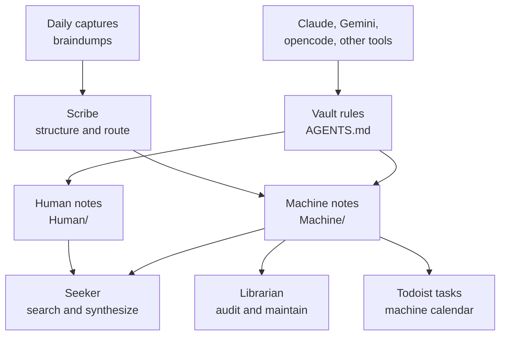

Most of my LLM tooling still works as if the project folder is the world.

That works for code. It works less well for everything around the code.

A coding agent can read `README.md`, inspect source files, run tests, and make a reasonable change. But the same agent usually has no idea what I decided last week, which workflows I already investigated, what my calendar constraints are, or which notes should be treated as mine rather than machine-authored working material.

I wanted a memory layer that could sit outside any one project. Not a vector database first. Not a new knowledge product. Just a place where different LLMs can read and write durable context under clear rules.

For me, that place is Obsidian.

The important part is not just that the files are Markdown. The important part is that the vault has rules, roles, provenance, and permission boundaries. Claude, Gemini, opencode, or another tool can all use the same memory system without each one inventing its own private conventions.



## One Root Policy

At the root of the vault, `AGENTS.md` is the canonical instruction file.

There are also `CLAUDE.md` and `GEMINI.md` files, but they are deliberately thin. They point back to `AGENTS.md` rather than restating the rules.

That sounds minor, but it matters. If every LLM-specific file contains its own copy of the vault policy, the policies will drift. One tool will learn an old folder rule. Another will keep an outdated frontmatter schema. A third might be allowed to edit something that should be protected.

The rule is simple: `AGENTS.md` owns the vault policy. Tool-specific files can add genuinely tool-specific notes, but they should not create a second version of the rules.

The local opencode Obsidian vault skill acts as an adapter around those vault rules. It lets a project working in one folder still use `/home/ben/vault` as memory outside the project. The reusable public skills live in my [`claude-skills`](https://github.com/hoombar/claude-skills) repo. The most relevant public example for this post is [`obsidian-braindump-retro`](https://github.com/hoombar/claude-skills/tree/main/skills/obsidian-braindump-retro), which I will come back to later.

That gives me three layers:

- The project agent knows the current repo.
- The vault skill knows how to enter the vault safely.
- The root vault files define what safe means.

## Human Notes And Machine Notes

The vault has two top-level areas that matter for this system:

```text
Human/
Machine/
```

`Human/` is for notes I created or curated as myself.

`Machine/` is for AI-generated files, research notes, SOPs, script documentation, and other machine-authored working material.

The standing rule is that AI-generated files, research notes, and SOPs default to `Machine/`. An assistant must not create, edit, move, or delete anything under `Human/` without explicit case-by-case permission in the current conversation.

This is the main safety boundary inside the vault.

I still want LLMs to search `Human/` when I ask what I know about something. If I wrote a note two years ago, it is useful for an assistant to find it. But reading and editing are different permissions. Searching across both folders is fine. Mutating both folders by default is not.

This also keeps provenance honest. If I am looking at a note under `Human/`, I know it is mine unless I explicitly allowed an edit. If I am looking under `Machine/`, I know it is part of the machine-maintained layer and should be judged that way.

## Frontmatter Is The Index

Every note in `Machine/` needs YAML frontmatter in this shape:

```yaml
---
title: "Concise Title"
type: "research" # or "doc", "sop", "script-doc"
topic: "Specific Domain"
captured: YYYY-MM-DD
updated: YYYY-MM-DD
staleness: "Short description of volatility (e.g., 'High - 1 month', 'Low - 10 years')"
---
```

This is boring in the right way. The fields are there because machine-maintained notes need to be found, routed, audited, and aged out.

`title` is for scanning and indexing. Filenames are useful, but they are not always enough. A concise title gives both me and an LLM a quick handle for what the note is.

`type` tells tools how to handle the note. A research note, an SOP, a general doc, and script documentation should not all be treated the same. A stale research note might need a fresh check. A stale SOP might need a validation run. Script documentation may need to be compared against the current script.

`topic` is for semantic routing. It gives the note a domain without requiring the folder hierarchy to carry all meaning. When an assistant is deciding where a capture belongs or what related notes to inspect, topic is a useful low-friction signal.

`captured` is provenance. It says when this information entered the machine layer.

`updated` is maintenance state. If the note has been revised, I want that visible without reading the whole file history.

`staleness` is for librarian audits. Some notes go stale in a month. Some are stable for years. A note about an API integration may need review quickly. A note about a personal naming convention may not. Putting the expected volatility in the note lets an assistant audit intelligently instead of treating all old files as equally suspicious.

The point is not to create a perfect metadata system. It is to give future agents enough structure to avoid guessing.

## The Three Vault Roles

The root instructions define three useful roles: Scribe, Seeker, and Librarian.

These are not separate products. They are activation patterns. They tell the assistant how to behave depending on the user's request.

The instructions are written as behavioural rules rather than long persona prompts. The shape is closer to this:

```text
Scribe: messy input -> structure, destination, frontmatter, wikilinks, atomic notes.
Seeker: vault question -> search Human/ and Machine/, synthesize, cite, distinguish source type.
Librarian: vault health -> audit stale docs, frontmatter, folder limits, orphaned notes, broken links.
```

That makes the roles portable across tools. The same root file can guide Claude, Gemini, opencode, or anything else that knows to read the vault instructions first.

### Scribe

Scribe activates when the user shares raw or messy input, brain dumps, quick captures, or asks for something to be written down.

The useful instruction is that Scribe should extract structure from messy input, identify topics, action items, and references, determine the correct destination, apply the right frontmatter, search for related notes, add `[[Wikilinks]]`, and split multi-topic input into separate atomic notes.

That is the role I want when I paste a rough thought and say, "process this into the vault". The Scribe is not just transcribing. It is deciding whether the input is one note, several notes, an action, or a pointer to something that already exists.

### Seeker

Seeker activates when I ask about vault contents: "what do I know about X", "find my notes on Y", or "what did I write about Z".

The instruction is to search across both `Human/` and `Machine/`, synthesize findings from multiple notes, cite sources using `[[Wikilinks]]`, distinguish between human-authored and machine-generated sources, and say clearly when nothing relevant exists.

That last part is important. A memory system that always produces an answer is not trustworthy. Sometimes the right answer is: I searched the vault and did not find anything.

A useful Seeker answer should feel like this:

```text
I found two relevant Human notes and one Machine research note.

Human:
- [[Some Personal Note]] says ...
- [[Another Note]] says ...

Machine:
- [[Machine/Research/Foo]] captured a previous investigation into ...

I did not find an SOP for this.
```

That is much better than pretending the vault is one undifferentiated blob of context.

### Librarian

Librarian activates when the user asks about vault health or cleanup, or when it has been more than 30 days since the last audit.

The role checks `Machine/` docs for staleness, finds missing or incomplete YAML frontmatter, identifies folders exceeding the file limit, finds orphaned notes, and finds broken `[[Wikilinks]]`. It can fix `Machine/` issues autonomously, but it should suggest `Human/` fixes for approval.

This is where the frontmatter starts paying rent. Without `captured`, `updated`, and `staleness`, "audit the machine notes" becomes vague. With those fields, the assistant can make specific judgements.

## Credentials Are Part Of The Design

Memory is not only notes. Sometimes a note should become an action.

For me, that means the assistant may need limited access to Google Workspace or Todoist. This is where I try to be boring and explicit.

For Google Workspace, I use [`gws`](https://github.com/googleworkspace/cli) with two config directories.

The personal default profile lives at:

```text
~/.config/gws/
```

That profile is read-only and is used for reads.

The machine profile lives at:

```text
~/.config/gws-machine/
```

It is selected explicitly with `GOOGLE_WORKSPACE_CLI_CONFIG_DIR=~/.config/gws-machine` and is used for writes to machine-owned resources.

The separation is not just naming. Tokens live under separate config directories. Switching profiles is explicit via an environment variable on the command or shell session. The personal profile is authenticated with read-only scopes. The machine profile is a separate account with write scopes for machine-owned resources such as the machine calendar. Calendar sharing and account ownership then become part of the boundary: the assistant can read the personal context it needs, but its approved writes land in the machine account.

An anonymised read looks like this:

```bash
gws calendar events list \
  --params '{"calendarId":"personal-calendar@example.invalid","timeMin":"2026-05-29T00:00:00Z","timeMax":"2026-05-30T00:00:00Z","singleEvents":true,"maxResults":50}'
```

An anonymised write uses the machine profile explicitly:

```bash
GOOGLE_WORKSPACE_CLI_CONFIG_DIR=~/.config/gws-machine \
gws calendar events insert \
  --params '{"calendarId":"machine-calendar@example.invalid"}' \
  --json '{"summary":"Review machine notes audit","start":{"dateTime":"2026-05-30T10:00:00Z"},"end":{"dateTime":"2026-05-30T10:30:00Z"}}'
```

Write, update, and delete operations still require explicit verbal confirmation before execution. The useful outcome is that an LLM can add something to a machine calendar when I approve it, but it cannot delete important personal emails or calendar events as a side effect of being helpful.

That boundary changes how comfortable I am letting the memory system become active. It can move from "remember this" to "put this somewhere I will see it" without getting broad destructive access.

## Todoist Turns Memory Into Action

I also use the [`td` CLI](https://github.com/Doist/todoist-cli) for Todoist.

The rules are different from Google Workspace because task creation is usually lower risk:

- Adding tasks usually requires no confirmation.
- Destructive actions always require confirmation.
- Updating tasks verifies current state first.

This lets an assistant turn a vault capture into an action without making every small thing a negotiation.

For example, if a Scribe pass finds this in a capture:

```text
I need to review the machine notes around calendar permissions and make sure the GWS examples are anonymised.
```

It can become a Todoist task. If the assistant wants to delete or complete a task, that needs confirmation. If it wants to update a task, it should first read the current state so it does not overwrite something blindly.

The agent-facing command shape is deliberately structured rather than a natural-language quick add:

```bash
td task add \
  "Review machine notes around calendar permissions" \
  --due "today" \
  --priority p4
```

This is a small design choice, but it affects the feel of the whole system. A memory layer that only stores notes becomes another place to forget things. A memory layer that can create bounded actions is more useful.

## How Knowledge Compounds

The clearest example of compounding is my braindump retro workflow.

Daily notes can contain marked braindump blocks. These are not polished notes. They are the fragments that would otherwise disappear: irritations, half-decisions, repeated concerns, ideas I am not ready to structure yet.

The public [`obsidian-braindump-retro`](https://github.com/hoombar/claude-skills/tree/main/skills/obsidian-braindump-retro) skill processes those marked captures.

At a high level, it:

- Extracts marked captures from daily notes.
- Routes them into durable notes, actions, or threads.
- Keeps a ledger and checkpoint so it knows what has already been processed.
- Treats repeated thoughts across days as signal rather than noise.

That last point is the part I care about most.

A single capture might be nothing:

```text
The calendar permission setup still feels too easy to misuse.
```

On its own, that might become a small note or no action at all.

But if similar captures appear over several weeks, the system should not treat each one as a fresh isolated thought. It should start to see an active concern:

```text
2026-05-03: Calendar permission setup feels too easy to misuse.
2026-05-11: Need to separate machine calendar writes from personal reads.
2026-05-19: Check whether destructive GWS operations require explicit confirmation.
2026-05-28: Write down the token separation model before I forget the exact boundary.
```

A retro pass can route that into a thread about credential boundaries, create or update a `Machine/` note, and add an action to validate the current setup.

The state does not need to be complicated. The useful thing is that the next run has a record of what happened:

```json
{"capture_id":"2026-05-03-01","source_date":"2026-05-03","raw_status":"linked","thread_slug":"gws-credential-boundaries","routed_to":"Machine/AI Workflows/GWS Credential Boundaries.md"}
{"capture_id":"2026-05-11-02","source_date":"2026-05-11","raw_status":"linked","thread_slug":"gws-credential-boundaries","routed_to":"Machine/AI Workflows/GWS Credential Boundaries.md"}
{"capture_id":"2026-05-19-01","source_date":"2026-05-19","raw_status":"actioned","thread_slug":"gws-credential-boundaries","routed_to":"Todoist: Review GWS destructive-operation confirmation"}
```

The checkpoint then tells the next run where to resume:

```json
{"last_processed":"2026-05-19T23:59:59Z"}
```

When a similar thought appears later, the assistant should update the existing thread instead of creating another isolated note. That is the mechanical part of compounding: capture becomes routed state, routed state becomes retrieval context, and retrieval context changes what the next agent does.

The next run should not start over. It should use the thread, checkpoint, and action history. That is what I mean by compounding.

One thought captured today may become a thread. Repeated captures across weeks become evidence of an active concern. Future runs inherit the context instead of rediscovering the same pattern from scratch.

This is also why I prefer a simple ledger and checkpoint over a magical memory promise. I want to know what was processed, where it went, and what the system thinks is still open.

## What I Would Reuse

If I were setting this up again, I would start with the boundaries before adding any clever retrieval.

The minimum useful version is:

- One canonical root instruction file.
- Thin adapter files for each LLM tool.
- A protected human area.
- A machine-writable area.
- Required frontmatter for machine notes.
- Clear role instructions for capture, search, and maintenance.
- Separate credentials for human reads and machine writes.
- Explicit confirmation rules for destructive operations.
- A way to turn memory into actions.
- A periodic workflow that revisits messy captures and promotes repeated concerns.

You do not need my exact folders or tools. You do need the distinction between human-authored memory and machine-maintained memory. You need provenance. You need a maintenance pass. And if the assistant can touch external systems, you need credential boundaries that make accidents boring.

The trap is to treat "LLM memory" as one feature. In practice, it is several smaller policies working together.

Where can the model read? Where can it write? What does it have to cite? What does it have to ask before changing? How does it know whether a note is stale? What happens to an unresolved thought after the third time it appears?

Those questions are not glamorous, but they are the system.
