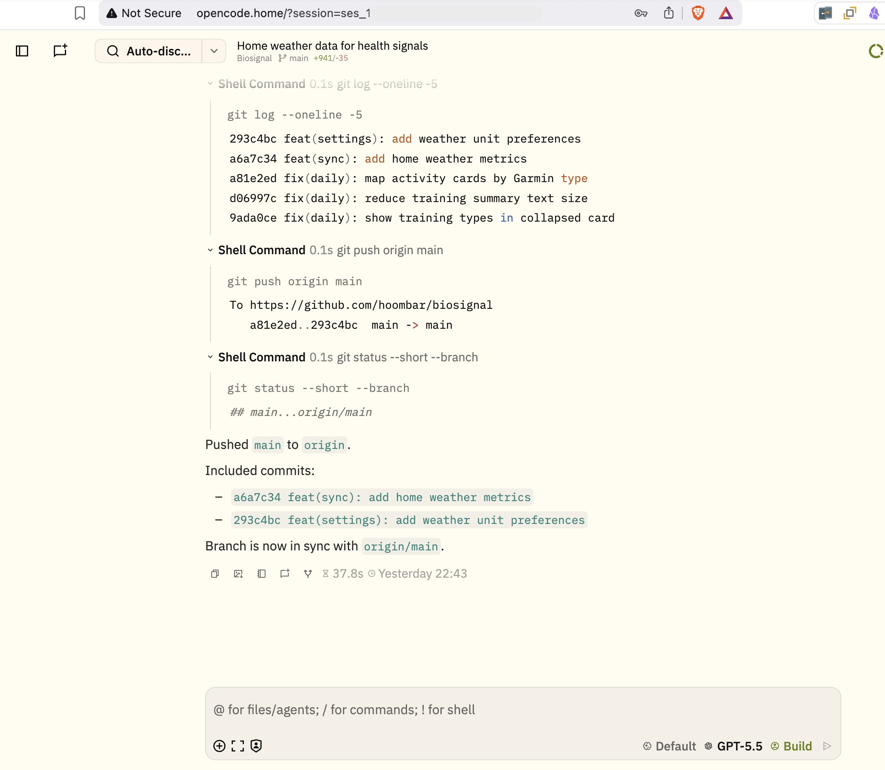
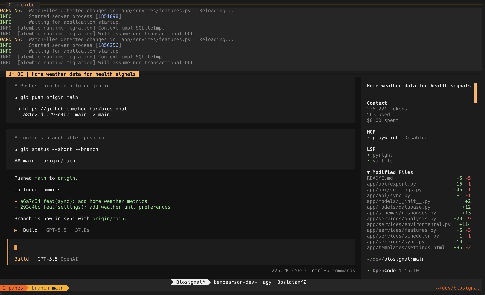
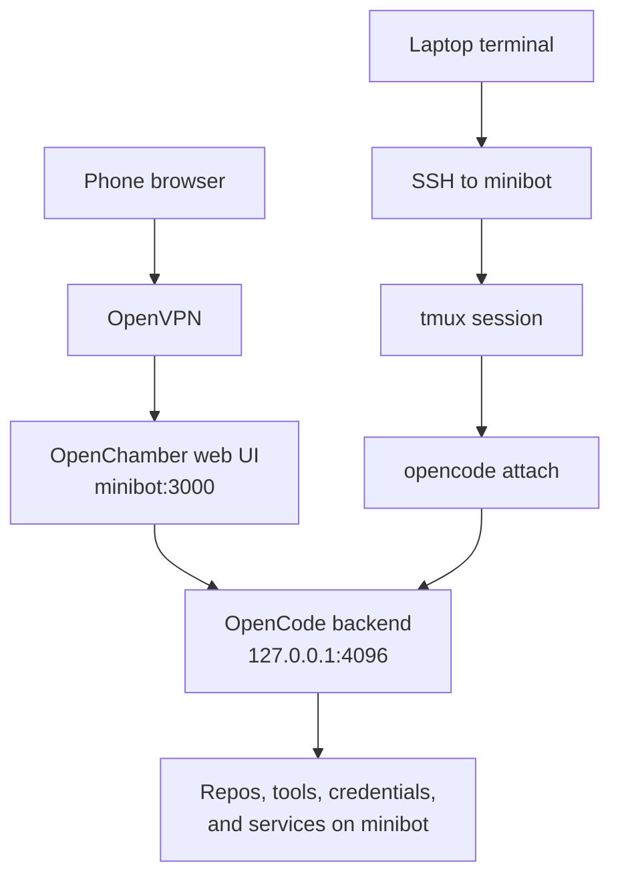

There is a funny little pattern I keep seeing in AI coding workflows: people leave their laptop open so the agent keeps running.

Not open because they are using it. Open because the laptop has become the place where the long-running agent session lives. The computer is doing the work, so the computer has to stay awake, and now the whole workflow depends on not closing the lid at the wrong time.

I wanted the opposite of that. I wanted to close the laptop, lock the phone, lose the SSH connection, or change rooms without caring. The agent should keep running because the agent is not really on the laptop or the phone.

This is where I ended up. The first view is the browser UI. The second is the terminal UI.



_OpenChamber showing the session from a browser._



_OpenCode attached to the same work from inside `tmux`._

Those two screenshots are different frontends onto the same setup. The first one is [OpenChamber](https://github.com/openchamber/openchamber) in a browser. The second is [OpenCode](https://opencode.ai/) running in a terminal inside `tmux`. They are both talking to the same OpenCode backend on a headless mini PC on my home network.

The important bit is not the web UI or the terminal UI by itself. The important bit is that the laptop and phone are just clients.

## The Actual Computer Is Minibot

I have a small GMKtec mini PC called `minibot` running Ubuntu Server. It sits on my home network as the boring, always-on development machine.

That means the development environment only needs to exist in one place. Repositories, package managers, local services, LSPs, agent config, credentials, shell aliases, and all the little fixes that make a machine usable live on `minibot`. My laptop does not need to be the canonical dev environment. My phone definitely does not.

The shape is roughly this:



OpenCode runs as a server on `minibot` and listens only on localhost:

```bash
opencode serve --port 4096 --hostname 127.0.0.1
```

OpenChamber runs beside it and connects to that backend. It is the part I expose to the LAN/VPN side:

```bash
OPENCODE_HOST=http://localhost:4096 \
OPENCODE_SKIP_START=true \
openchamber serve --port 3000 --host 0.0.0.0 --foreground
```

The OpenCode backend is only bound to localhost. OpenChamber is the thing exposed on the LAN/VPN side, and in my setup it is reachable over my VPN rather than publicly forwarded to the internet.

In day-to-day use these run as user-level `systemd` services:

```text
opencode.service     -> opencode serve on 127.0.0.1:4096
openchamber.service  -> openchamber serve on 0.0.0.0:3000
```

The boundary is the part that matters: OpenCode is local to `minibot`; OpenChamber is the remote UI; VPN access is the outer gate.

From the laptop I can SSH into `minibot`, land in `tmux`, and attach to the same backend from whichever project directory I want:

```bash
opencode attach http://localhost:4096 --dir ~/dev/biosignal
```

The `tmux` part is automatic. My `~/.bashrc` on `minibot` checks that the shell is interactive, then attaches to an existing tmux session or creates one called `main`:

```bash
if [ -t 0 ] && [ -t 1 ] && command -v tmux &>/dev/null && [ -z "$TMUX" ]; then
  tmux attach-session 2>/dev/null || tmux new-session -s main
fi
```

That means a normal SSH connection drops me straight back into the persistent terminal workspace. I do not have to remember to start tmux before doing agent work, which is important because forgetting that once is exactly how you end up tying a long-running task to a fragile SSH connection.

I also have a small wrapper named `oc` so I do not have to type the full attach command each time. It defaults to the current directory, reads the private service environment if it is available, and then attaches to the OpenCode server on localhost:

```bash
url="${OPENCODE_ATTACH_URL:-http://localhost:4096}"
default_dir="${OPENCODE_DEFAULT_DIR:-$PWD}"
env_file="${OPENCODE_ENV_FILE:-/home/ben/.config/opencode-openchamber/env}"

if [[ $# -eq 0 ]]; then
  exec opencode attach "$url" --dir "$default_dir"
fi
```

In practice that means I can SSH in, `cd` to a project, run `oc`, and get an OpenCode terminal session attached to that directory. If I want to be explicit, `oc .` attaches OpenCode to the current directory. On the phone, OpenChamber's project picker can open the same workspace.

## The Frontend Can Disappear

The part that changes the feel of the workflow is that the client can disappear.

If I start a task from OpenChamber on my phone, the phone is not where the work is happening. I can lock it, put it away, or lose mobile signal. The OpenCode backend is still running on `minibot`.

If I start a task from the laptop over SSH, the same thing is true in a slightly different way. The SSH session is just the connection into the machine. Inside that connection I am usually in `tmux`, and the agent is running in a tmux session on `minibot`.

That gives me two layers of persistence, and they solve slightly different problems:

- OpenCode keeps the backend session available for different clients to attach to.
- `tmux` keeps the terminal frontend alive even if SSH dies.

So if the laptop sleeps, the network drops, or I close the terminal window, I can reconnect later and the session is still there. The terminal did not own the work; it was just attached to it. I am not trying to keep a MacBook awake so a coding agent can finish pushing a branch.

> The boundary that matters is not laptop versus phone. It is client versus machine doing the work.

That sounds obvious once written down, but a lot of agent workflows still blur that line. They treat the device in your hands as the runtime. That works until the task takes longer than the coffee break.

The other change is more subtle: I can keep the same thread of work moving across devices. I might start a change from the laptop while I have the full terminal in front of me, leave the house, check the agent's progress from my phone, ask it to adjust something, then come back to the laptop and continue from the terminal without mentally reconstructing what happened. The work did not move between devices. I did.

## Why Keep The Terminal Path?

OpenChamber makes the phone path much nicer. It gives me a browser UI for chat, diffs, file navigation, session selection, and session continuation. On a phone, that is much better than fighting a tiny terminal keyboard for every interaction.

But I do not want the browser UI to be the only interface.

When I am on the laptop, the terminal path is still the one I trust most. I can use `tmux`, inspect processes, restart services, run local dev servers, check logs, and generally move around the machine without leaving the same environment. OpenChamber is a good interface onto the agent. SSH and `tmux` are still the control plane for the box.

That split is important. I do not want a phone-first workflow that makes the laptop worse, and I do not want a terminal-first workflow that makes the phone useless. The system works because both clients are allowed to be good at different things.

This is also why I like having both screenshots together. The browser view and the terminal view look like different workflows, but they are really two windows into the same system.

## Image Paste Was The Annoying Missing Piece

One of the small things that matters more than it should is image paste.

When the agent is running locally, pasting a screenshot into the session is boring. When the agent is running on a remote Linux box through SSH and `tmux`, your Mac clipboard is suddenly not the remote clipboard. For agent work, that is a real limitation. Screenshots, UI bugs, charts, and diagrams are often the fastest way to explain the problem.

I use [`cc-clip`](https://github.com/ShunmeiCho/cc-clip) for this. It bridges image paste into remote agent sessions over SSH. For OpenCode, it works through the normal `xclip` or `wl-paste` path, so OpenCode can read the image as if it were available on the remote clipboard.

The daily command I use from my Mac is a tiny wrapper called `minibot`:

```bash
#!/usr/bin/env bash
set -euo pipefail

HOST="${1:-minibot}"
shift || true

echo "Syncing cc-clip token for ${HOST}..."
if ! cc-clip connect "$HOST" --codex --token-only; then
  echo "cc-clip --codex token sync failed; retrying token-only..."
  cc-clip connect "$HOST" --token-only
fi

echo "Connecting to ${HOST}..."
exec ssh "$HOST" "$@"
```

That script does two jobs. It refreshes the `cc-clip` token so the clipboard bridge is not stale, then it opens SSH to `minibot`. From there, my shell auto-attaches to `tmux`, and I can paste images into the remote agent session from the Mac clipboard.

The `--codex` fallback in the script is there because I also use Codex-style terminal workflows on the same box. For OpenCode itself, `cc-clip` uses the simpler clipboard shim path. The point is not that every agent needs exactly the same clipboard plumbing; it is that the remote session should not lose the basic ability to accept a screenshot.

This is not the main architecture, but it removes a lot of friction. Without it, the remote setup feels powerful but slightly worse than local. With it, I can keep the agent on the mini PC without giving up one of the basic affordances I expect from a local coding session.

## The Security Boundary Matters

I do not want this exposed directly to the public internet.

The OpenCode backend listens on `127.0.0.1`. OpenChamber is reachable on the network side, but only across my LAN/VPN path. The setup is deliberately boring: user-level `systemd` services, local ports, VPN access, no public port forwarding.

That boundary is part of why I like this more than a half-public web service. The phone UI is convenient, but the machine is still a home development box. I can reach it remotely because I am on the VPN, not because the agent server is hanging off the open internet.

There is a different risk that has nothing to do with ports: concurrent edits.

Multiple clients are fine. A phone UI and a laptop terminal can both attach to the same backend. The danger starts when multiple agents are changing the same working tree or branch at the same time. That is not solved by OpenCode, OpenChamber, or `tmux`; it needs the usual discipline of separate branches, separate worktrees, or just not doing that.

This is the part I would be most careful about if I pushed the setup further. The system makes it easy to start work from more places. That does not mean every task should run at once in the same checkout.

## What This Changes

The practical change is that I can start work from wherever I am and not keep carrying the runtime around with me.

From the phone, I can open OpenChamber, check what an agent did, ask for a follow-up, or kick off a small change. From the laptop, I can SSH in and use the terminal path when I need more control. If either frontend disappears, the machine doing the work keeps going.

It also makes the setup feel less fragile. I am not trying to keep three devices configured as development environments. I am setting up one small Linux machine properly and then giving myself a few good ways to reach it.

That is the part I think will matter more as agent workflows get longer-running. The interesting question is not just which model is best or which editor has the nicest chat panel. It is where the work should live when the work keeps going after you close the lid.

For me, at least for now, the answer is a small box called `minibot`.
