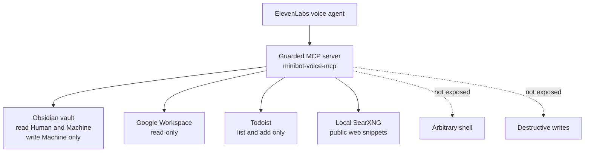

I do not always want to type.

That is the simple reason I keep coming back to voice agents. Sometimes I am walking the dog, making coffee, tidying up, or away from a proper keyboard, and the thing I want to do is small enough that typing feels like the wrong interface. Check what is on the calendar. Capture a task before I forget it. Ask where I wrote something down. Turn a half-thought into a note I can clean up later.

A concrete example: imagine I am out walking the dog and suddenly remember that I never set up a maintenance schedule for the reverse osmosis unit under the sink. That is exactly the kind of thought that can disappear before I get back to a laptop. A useful voice agent should be able to search my Obsidian vault for the unit model and any existing maintenance note, check the web if the schedule is missing, and then add a recurring Todoist task with the right filters at the right interval.

That is a much better fit for voice than trying to SSH into a machine from my phone, attach to a session, type a careful prompt, inspect notes, search the web, and manually create the task. The work is not complicated enough to justify that friction, but it is useful enough that I do not want to lose it.

The frustrating part is that most voice agents still feel oddly thin. They can talk, and the speech layer can be very good, but they often do not have enough memory or tooling to be useful in the places where voice makes sense. If the agent cannot reach my notes, calendar, tasks, or a small set of personal tools, then it is mostly a nicer microphone on top of a generic chatbot.

So I have been experimenting with an [ElevenLabs](https://elevenlabs.io/) voice agent connected to a small [MCP](https://modelcontextprotocol.io/) server on `minibot`, my always-on home development machine. The aim is to make the voice agent useful while I am away from the keyboard, without turning it into a general voice shell.

That second half matters. The same memory and tooling that make the agent useful also make it worth constraining. I want it to find notes, read calendar context, and add simple tasks. I do not want to stand in the kitchen and accidentally give an agent arbitrary command execution on the box that has my notes, repositories, local services, and enough credentials to do real damage.

> Voice is useful when I can use it away from the keyboard. It becomes risky when "away from the keyboard" also means "away from review".

## The Shape Of It

The project is a small Node MCP server called `minibot-voice-mcp`. It gives the voice agent a deliberately limited set of tools for the things I actually want to do while I am not sitting at a keyboard:

- Search and read my Obsidian vault.
- Create or append notes only under the machine-authored part of the vault.
- Read Google Workspace data through `gws`.
- List or add Todoist tasks.
- Search the public web through a local [SearXNG](https://docs.searxng.org/) instance.

Those are the useful bits: memory, calendar context, tasks, and lightweight public search.

The constraint is just as important. It does not expose a shell. It does not expose Gmail, Drive, or Calendar write tools. It does not expose Todoist complete, delete, or update. It does not allow writes under `Human/` in my Obsidian vault.

The rough architecture looks like this:



The connection details are deliberately less interesting than the tool surface. The important part is that the voice agent reaches the same small set of MCP tools every time, rather than getting a broad backdoor into the machine.

## Why It Needs Its Own Tool Surface

I already have strong agent tooling on `minibot`. OpenCode can read files, edit code, run tests, call local tools, and work across projects. That is exactly what I want when I am sitting at the terminal and intentionally doing software work.

It is also too much as the default permission set for a voice agent.

The useful voice use cases are small and opportunistic. If I am out walking and remember the RO unit needs a maintenance schedule, I want to say it immediately. If I am making breakfast and wonder what is on the calendar later, I want a quick answer. If I think of a task, I want it captured without opening Todoist.

That does not require the full coding-agent tool surface. It requires a much smaller one that is shaped around memory and personal admin.

Voice also changes the risk profile. The input can be ambiguous. The interaction is quick. The agent has to turn a spoken request into a tool call without the same level of review I get when I am watching a diff or approving a terminal command. A voice assistant should be able to answer, "What is on the calendar tomorrow?" or "Add a task to buy filters," but it should not be one fuzzy transcription away from running a command in my vault.

So I treated the voice layer as a separate client with its own tool surface, not as another way to drive my normal coding agent.

The server status tool makes that boundary visible. In plain terms, the MCP can report:

```json
{
  "writes": {
    "humanVault": false,
    "gws": false,
    "todoistAddTask": true,
    "todoistDestructiveActions": false
  }
}
```

That small shape is more useful than a long prompt saying "be careful". The model can still make a bad judgement, but it cannot call a tool that does not exist.

## The Obsidian Boundary

My vault already has a strong split between `Human/` and `Machine/` notes. `Human/` is for notes I created or curated as myself. `Machine/` is for AI-generated working material, research, SOPs, and other assistant-maintained context.

The voice MCP preserves that boundary.

It can search and read across the vault, because a useful assistant needs to find things I wrote down. It can also create or append notes, but only under `Machine/`, and only with the required frontmatter shape. It refuses writes outside that area.

The tool for creating a machine note takes fields like:

```json
{
  "title": "Reverse Osmosis Filter Notes",
  "topic": "Smart Home",
  "type": "doc",
  "content": "..."
}
```

The server then chooses the `Machine/` topic folder, applies frontmatter, checks that the destination is still inside the allowed root, and refuses crowded folders that should be reorganised first.

That may sound like a lot of fuss for a voice note, but it means the voice agent is not inventing its own filing rules. It is using the same vault policy that my other assistants use.

> A voice interface should not get a weaker permission model just because it feels more casual.

## Google Workspace Is Read-Only

The Google Workspace tools are intentionally read-only.

The MCP can list calendar events, search Gmail threads, fetch a Gmail thread, search Drive, and export a Drive file as text. It does that through `gws`, with the same separation I use elsewhere between a personal profile and a machine profile.

What it cannot do is create, update, or delete Google Workspace data.

That is not because those actions would never be useful. A voice assistant that can add a calendar event sounds useful. The problem is that my standing rule for Google Workspace writes is explicit confirmation in chat before execution. The ElevenLabs voice flow is not the place where I want to blur that rule.

For now, read-only is the right line. If I want calendar writes later, I would rather add one narrow tool with a very specific shape than expose a general write surface.

## Todoist Gets One Write Tool

Todoist is different. Adding a task is a common voice-assistant action, and the downside is usually lower than modifying email or calendar data.

So the MCP exposes:

- `todoist_list_tasks`
- `todoist_add_task`

It does not expose complete, delete, or update.

That lets the voice agent handle requests like:

```json
{
  "content": "Replace reverse osmosis filters",
  "dueString": "every 6 months"
}
```

without giving it a tool that can clear out tasks, silently reschedule things, or mark work as done because it misunderstood me.

The pattern is not "all writes are bad". The pattern is that each write has to earn its place in the tool list.

## The Tool Contract Is Boring

The MCP server is deliberately boring at the tool level. Each tool has a small schema, a narrow job, and a predictable text result for the voice agent to use.

That matters because voice interactions do not give me the same review surface as a terminal session. If a tool fails, the useful response is a short explanation that can be spoken back, not a raw stack trace. If a tool succeeds, the result needs to be compact enough for the agent to turn into a useful answer rather than a dump of private data.

There are a few implementation details that matter for that contract:

- Tool names are checked against an allowlist.
- Runtime tokens live outside the repo in ignored environment files.
- Vault reads and machine-note writes resolve paths against real roots, so `../` tricks should not escape the allowed areas.
- Obsidian outputs are redacted before they return to the voice layer.
- Google Workspace writes and destructive Todoist actions are not part of the tool list.

Those details do not make it perfect. They make the failure modes smaller.

## Redaction Is A Guardrail, Not A Permission Model

The server redacts obvious secrets in vault outputs before returning them to the voice layer. It looks for things like API-key-shaped assignments and common token prefixes.

That is useful, but I do not want to overstate it. Redaction is a guardrail. It is not the real security model.

The real model is:

- Do not put secrets in notes if they do not belong there.
- Do not expose arbitrary file reads outside the vault.
- Do not expose arbitrary shell execution.
- Do not expose destructive tools unless there is a specific reason.
- Keep runtime secrets in ignored env files outside the repo.

The redaction pass is there because private notes are messy and humans make mistakes. It should reduce accidental leakage, not justify a broader tool surface.

## What This Makes Possible

The useful voice interactions are small, which is why they are easy to underrate.

I can go for a walk and still ask what is on the calendar. I can remember the RO unit under the sink, have the agent check whether I already wrote down the model or maintenance schedule, ask it to search the web if my notes do not have the answer, and then create the recurring Todoist reminder before I get home. I can turn a loose thought into a machine note that I can clean up later, without allowing the voice agent to write into my human-authored notes.

None of that is spectacular. That is partly why I like it. The point is not to make voice feel like a demo. It is to make it useful in the moments where typing is enough friction that the thought might otherwise disappear.

The better voice assistant is not the one with the biggest possible tool list. It is the one with the right memory, the right small tools, and a permission boundary that is not as casual as the interface.

There is still plenty I would improve. The voice UX depends on how well the agent chooses and sequences tools. I also need to keep testing the places where a spoken request could be interpreted too broadly, and I would like better review metadata for notes or tasks created from voice.

But the basic pattern feels right: voice on the outside, memory and small tools in the middle, real private systems behind a permission boundary that does not depend on vibes.

That is the version I am comfortable building on.
